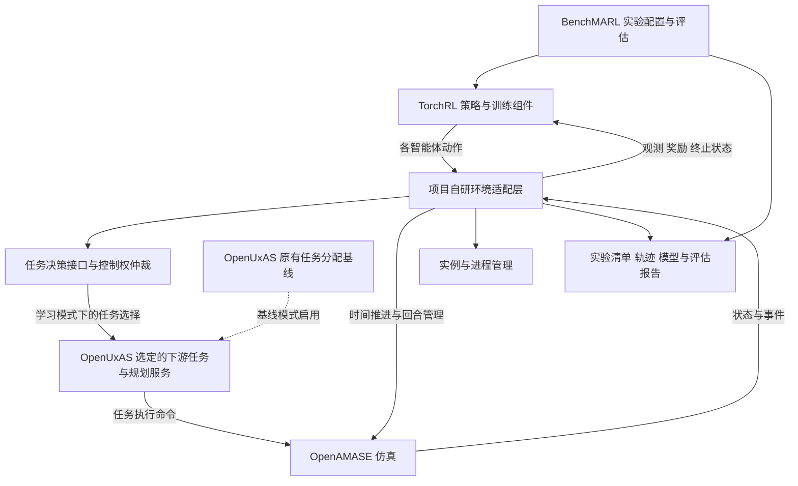

# 多飞行器与多智能体训练平台实施技术建议书及资源清单

**技术路线：OpenAMASE＋OpenUxAS＋TorchRL／BenchMARL**

| 文档项 | 内容 |
| --- | --- |
| 版本 | V1.0，团队启动与技术评审稿 |
| 编制日期 | 2026-09-16 |
| 适用对象 | 技术负责人、仿真开发、强化学习开发、测试与实验评估人员 |
| 已确定路线 | OpenAMASE 承担仿真；OpenUxAS 提供自主任务服务与规则基线；TorchRL 承担训练组件；BenchMARL 组织多智能体实验 |
| 首期目标 | 完成一个可重复运行、可批量采样、可比较算法的多飞行器任务分配与协同验证闭环 |
| 证据状态 | 已核查公开源码页面和官方文档；尚未在团队目标设备上构建、联调或运行训练 |

> 本文中的系统架构、接口字段、场景规模、进度和验收数量属于实施建议，不是上述开源项目已经具备的完整产品能力。正式版本基线、性能指标和算法收益应由团队实测后冻结。尤其不能把“存在网络接口”视为“已有强化学习同步环境”，也不能把“算法已实现”视为“在本项目场景中已经有效”。

## 1. 项目目标与实施原则

### 1.1 建设目标

建设面向任务级决策研究的训练与验证平台，逐步支持：

1. 多飞行器任务选择、任务分配与动态再分配。
2. 多智能体在局部观测条件下的协同决策。
3. 多团队在抽象资源竞争等场景中的策略对抗与交叉评估。
4. 规则策略、规划策略和学习策略的轨迹采集、样本管理与重复实验。
5. 学习策略在原有仿真场景中的回放、指标分析与适用范围评估。

首期采用“少量实体、离散任务动作、固定决策周期、结构化观测”的方案。先确认决策闭环和实验方法正确，再扩展通信约束、实体失效、不同规模和对抗训练。

### 1.2 技术取舍

| 决策 | 实施要求 |
| --- | --- |
| 以既定四组件路线为主线 | 不再因算法目录或仓库热度反复切换框架 |
| 直接实现 TorchRL 环境适配 | Gymnasium／PettingZoo 暂不作为必经接口层；依赖中出现相关包不等于需要另建一套环境 |
| 用 BenchMARL 组织算法实验 | 优先复用训练流程、配置、模型和报告接口，项目侧集中开发仿真适配与任务模型 |
| 保持仿真业务语义独立 | 任务状态、动作生命周期、观测权限与时间语义先定义，再映射到 LMCP 和 TensorDict |
| 以复现和测试评价开源组件 | 算法数量、机构名称、星标和提交次数都不能代替项目级验证 |
| 按问题选择算法 | 首期聚焦 IPPO、MAPPO，条件适合时加入 QMIX；不以集齐算法为建设目标 |

### 1.3 首期范围边界

首期覆盖任务级协同及简化飞行执行，不将以下内容纳入交付承诺：高保真气动、信号级传感器与通信、大规模实体实时推演、实机飞控接入、完整对抗联赛平台。后续研究需要这些能力时，应单独建设模型并校准。

OpenAMASE 官方定位为基本保真度的多无人机任务仿真，提供运动、自动驾驶、简化传感器及网络交互能力；其定位适合任务级验证，但不能直接据此推导现实系统效能。[R01]

## 2. 系统分工与总体架构

### 2.1 四个开源组件与项目自研部分

| 部分 | 承担职责 | 需要避免的误解 |
| --- | --- | --- |
| OpenAMASE | 推进仿真状态、执行飞行命令、产生场景反馈、提供可视化与回放基础 | 它本身不是已经接好的 TorchRL 训练环境 |
| OpenUxAS | 任务服务、规划与任务分配基线；在学习模式下保留已明确授权的下游服务 | 不应与学习策略同时拥有同一个分配决策的最终控制权 |
| TorchRL | 环境接口、张量数据、采样、网络与损失组件、训练相关数据处理 | GPU 训练不会自动把 Java／C++ 仿真改成 GPU 仿真 |
| BenchMARL | 算法、模型、任务和实验配置；训练、评估及结果组织 | 多团队支持不等于完整历史对手池与联赛调度已经实现 |
| 项目自研适配层 | 时间同步、进程管理、消息桥接、观测构造、动作转换、奖励、终止与数据溯源 | 这是主要集成工作，不能省略为一个简单的消息转发脚本 |

OpenUxAS 使用消息驱动的服务架构，内部通信采用 ZeroMQ，消息遵循 LMCP；其官方示例包含任务分配和规划服务。BenchMARL 基于 TorchRL 组织多智能体实验。[R02] [R04]

### 2.2 推荐架构



图中“学习策略接入下游服务”是拟实现的架构关系，不表示存在一个已验证、可直接替换的分配器接口。接入位置必须通过消息链分析确定。

### 2.3 决策控制权

提供两种显式模式，并写入每次实验的配置：

- **基线模式：**OpenUxAS 负责其原有任务分配与规划，适配层负责驱动场景和采集结果。
- **学习模式：**学习策略负责预先约定的任务选择／分配决策，OpenUxAS 仅保留经确认的下游规划与执行服务。

如果首个集成版本只允许学习策略调整任务优先级，而最终分配仍由 OpenUxAS 完成，实验名称必须标为“学习优先级辅助规划”，不能记作“学习任务分配”。

已有 WaterwaySearch 配置中可见分配、路线规划、计划构建与网络桥接服务。团队应据此追踪真实消息链，而不是直接删除某项服务后假定其他部分仍然工作。[R06]

## 3. 版本基线、部署与首次验证

### 3.1 已发现的重要兼容约束

截至编制日期，BenchMARL `main` 分支的 `setup.py` 明确声明：

```text
torchrl >= 0.10, < 0.12
```

因此，首版不能把 BenchMARL 当前源码与最新 TorchRL 直接拼装。该约束来自具体分支文件，不应推广为所有历史或未来发布版的约束。团队应先选择 BenchMARL 的明确提交或发布版本，再核对该版本依赖。[R05]

| 项目 | 推荐起点 | 冻结条件 |
| --- | --- | --- |
| 系统 | Linux x86_64；以 Ubuntu 22.04 作为初始集成环境 | OpenUxAS 官方构建及示例通过；镜像和系统包版本留档 |
| OpenUxAS | 官方 `develop` 中经验证的提交 | 原生示例、消息日志与无界面运行验证通过 |
| OpenAMASE | 优先采用上述 OpenUxAS 构建流程选取的版本组合 | 记录其实际 SHA；不可只记录 OpenUxAS SHA |
| LMCP 与生成器 | 与两端软件一致的消息定义和生成工具版本 | 双向消息序列化、字段和单位验证通过 |
| BenchMARL | 明确提交／发布版本；首版按其依赖范围选择 TorchRL | 官方小场景训练、保存、加载和评估通过 |
| TorchRL | 在当前已核查约束下，优先验证 0.11 系列的具体补丁版本 | 与 BenchMARL、PyTorch、TensorDict 的组合测试通过 |
| Python | 建议从 3.11 开始验证 | 依赖求解与目标系统安装通过 |
| PyTorch、TensorDict、CUDA | 按所选软件和驱动共同确定 | CPU 验证后再验证 GPU；保存精确版本和安装来源 |

上表是候选组合，不是已验证安装清单。冻结时同时保存源码 SHA、依赖锁定文件、构建日志、驱动信息、镜像摘要以及必要的项目补丁。

实施文档应使用与锁定版本一致的 API。资源清单给出了 TorchRL 0.11 教程；对于只能使用 `main`、`stable` 或 `latest` 的在线入口，需要回查锁定源码，避免照搬更新版本的类名和参数。

### 3.2 首次启动顺序

**仿真工作线：**先运行 OpenUxAS 官方示例，确认其与 OpenAMASE 的既有链路。官方入口如下，执行前应检出团队审定的源码提交；本文未实际执行这些命令。[R02]

```bash
# 工作目录：团队选定的 OpenUxAS 源码目录
./anod build uxas
./anod build amase
./run-example 02_Example_WaterwaySearch
```

随后验证无界面运行、启动与退出、日志落盘、实例端口分配和场景重复执行。无界面运行与严格同步步进必须分别验证，前者通过不代表后者具备。

**训练工作线：**在独立 Python 环境中锁定依赖，先复现 BenchMARL 的一个小型 VMAS 协同示例。VMAS 在本项目中只用于验证训练软件安装和实验流程，不替代已经确定的 OpenAMASE 业务仿真主线。[R04] [R09]

训练工作线至少完成一次采样、若干参数更新、模型保存、重新加载和独立评估。出现有限损失值、参数发生变化只能证明训练程序运行，不能视为策略已经学会任务。

### 3.3 开源来源与使用记录

保存所有组件的原始来源、版本和许可证。OpenAMASE／OpenUxAS 使用 Air Force Open Source Agreement，官方 README 还提示使用登记事项；由项目责任人按许可证原文核对单位的使用、修改和分发安排。此项为部署前资料核对，不由本建议书代替许可判断。[R18] [R19]

## 4. 仿真—训练接口设计

### 4.1 先形成接口约定，再开发框架封装

以下名称是建议的项目内部字段，不是现成的 LMCP 字段。适配层负责映射；不要求直接修改全部外部消息定义。

| 字段／对象 | 含义 | 核心约束 |
| --- | --- | --- |
| `env_instance_id` | 并行环境实例标识 | 区分不同进程组、端口和输出目录 |
| `episode_id` | 回合标识 | 每次 reset 更新；旧消息不能污染新回合 |
| `decision_step` | 决策步编号 | 在同一回合内单调递增 |
| `sim_time`、`delta_t` | 仿真时刻与本步实际持续时间 | 单位固定为秒；与墙钟耗时分开 |
| `state_snapshot_id` | 构造一次联合观测所依据的快照版本 | 同一步各智能体观测必须具有一致的时间依据 |
| `agent_id` | 智能体身份 | 固定其与车辆 ID、张量位置的映射 |
| `task_id`、`task_version` | 任务身份与版本 | 更新后的任务不能接收旧请求的完成反馈 |
| `request_id` | 动作请求标识 | 用于去重、接受确认、取消与状态追踪 |
| `policy_version` | 采集该动作的策略版本 | 样本与策略、对手配置可追溯 |
| `action_mask` | 在当前观测及约束下允许的动作 | 不得通过掩码泄漏智能体不可获得的真值 |
| `valid_agent_mask` | 有效实体／填充位置标识 | 不与训练序列填充掩码混用 |
| `transition_valid` | 状态转移是否完整可信 | 技术故障产生的残缺记录不得作为正常训练样本 |

任务执行状态至少区分：`accepted`、`running`、`succeeded`、`failed`、`cancelled`。其中“请求被接受”不等于“任务已完成”。持续任务只在创建或切换时发送新请求；后续步骤追踪原请求，避免每个决策步反复重建任务。

### 4.2 时间推进：首期采用固定决策周期

首个任务可用 **5 秒仿真时间**作为决策间隔的候选值；该值用于启动试验，需按运动速度、任务距离和反应要求校准。运动积分步长与策略决策间隔分开设置。

一个决策步应遵循以下过程：

1. 在边界时刻 `t` 获取有效快照，冻结本步决策所用信息。
2. 为各智能体构造观测，计算动作及其合法性掩码。
3. 校验并提交本步联合动作，完成必要的接受确认。
4. 按约定推进到 `t + delta_t`，收集该时间段的任务事件。
5. 获取下一边界快照，计算奖励、终止标识与下一观测。
6. 形成一条完整状态转移，再允许下一决策步。

必须在第一阶段查明：AMASE 是否能可靠暂停并推进到指定边界；UxAS 的有关服务使用仿真时间还是墙钟；暂停仿真时规划服务是否仍能完成工作。若服务依赖仿真继续推进，不能无限等待规划结果而造成互锁，应定义明确的规划延迟语义或改造对应调度。

**不能用 Python 等待若干毫秒，替代仿真步进接口。** 如原生机制不满足要求，优先实现最小时间推进扩展和完成屏障，并将其作为独立交付件。若阶段评审确认只能支持自由运行的异步环境，应重新定义动作生效延迟、观测时间戳与算法适配，不能直接沿用“固定同步步长”的实验结论。

首期仅做固定周期。后期若改为任务完成等事件触发决策，应在轨迹中保存每步持续时间，评审变步长折扣和优势估计；不能把不同持续时间一律当成相同长度的训练步。

### 4.3 回合重置与异常处理

初版以可靠性优先，允许每回合重新启动相应 AMASE／UxAS 进程组。重置需覆盖：场景状态、任务服务缓存、规划结果、待处理消息、随机数状态、适配层缓存和策略循环网络状态。

用 `episode_id` 与 `request_id` 隔离过期消息；原生消息不带相关字段时，通过独立连接生命周期、进程边界及项目侧请求映射保证隔离。仅在多次验证与冷启动等价后，才引入更快的进程内重置。

区分三类结束：

- **任务自然终止：**目标达成，或场景规定的不可恢复失败，标记 `terminated`。
- **外部时间上限：**因采样长度限制停止，标记 `truncated`；若任务本身定义了硬截止期限，则其后果按任务终止建模，不能混淆。
- **技术故障：**进程崩溃、断连、缺失快照等，记录为运行异常，隔离受影响样本并重新创建环境；不得伪造正常下一观测或直接奖励为零。

对因时间限制截断但仍有有效末状态的样本，按算法约定处理价值自举。不能把 reset 后的新回合观测当成前一回合的末状态。

### 4.4 观测权限、动作与奖励

**观测：**首期使用结构化数值特征，包括自身位置与速度、任务状态、允许共享的队友信息、可选任务特征及信息年龄。全局真值可供评估和集中式 critic 使用；执行策略 actor 的输入必须单独审查。若所有实体都获得全局实时信息，应如实标注该信息假设。

**动作：**首期定义为“保持当前任务、选择候选任务、返回预定义等待区域”等有限离散动作。未实现电量或其他模型时，不应把对应字段包装成已经存在的物理反馈。

**冲突：**多个智能体选择同一排他任务时，采用预先声明、与算法无关的确定性规则；记录竞争失败与实际执行结果。该规则若集中裁决，应明确说明它是环境机制的一部分，不能把其贡献全部归因于学习策略。

**动作记录：**同时保存策略原始动作、环境实际执行动作和修改原因。PPO 类训练保留原始采样动作及对应概率，不能把仲裁后的动作覆盖成原动作后仍使用旧概率。若需要从根本上修改动作生成方式，应重新评审概率和训练语义。

**奖励：**先定义任务完成、时间、重复服务和约束违例的业务指标，再提出奖励，例如：

```text
本步团队奖励 = 完成新增任务的收益
             - 时间成本
             - 重复服务成本
             - 场景定义的约束违例成本
```

各项做尺度检查并单独记录，不在首版预设“万能权重”。共同奖励复制给多个智能体时，要检查训练端的求和／均值方式，避免实体数量增加导致奖励被重复放大。任务已完成的判定应来自统一业务判据，不能用规划器发出命令代替。

## 5. TorchRL 与 BenchMARL 的实现途径

### 5.1 TorchRL 环境封装

以 `EnvBase` 为基础实现有状态环境，至少覆盖 `_reset()`、`_step()`、`_set_seed()` 及环境规格。种子应传播到项目可控制的全部随机源；设置 Python 种子不能自动保证外部仿真确定性。[R10]

以下为首期一个同构智能体组的逻辑数据约定。实际动作编码和返回规格以锁定版本为准。

| 数据 | 单环境建议形状 | 用途 |
| --- | --- | --- |
| `agents.observation` | `[N, O]` | 各智能体局部观测 |
| `agents.action_mask` | `[N, K]` | 每个智能体的 K 个离散动作可用性 |
| `agents.action` | `[N, 1]` 或所选分布要求的形状 | 策略选择，编码全链路一致 |
| `agents.reward` | `[N, 1]` | 明确共享／个体奖励语义 |
| `state` | `[S]` | 可选全局状态，供集中式 critic 使用 |
| `done`、`terminated`、`truncated` | `[1]` | 团队回合结束语义 |
| `agents.valid_agent_mask` | `[N, 1]` | 有效实体标记，属项目自定义字段 |

并行后增加环境维度，采样后增加时间维度；不得把“多个环境”“多个时刻”“多个智能体”混为同一批维度。`_step()` 按 API 返回下一状态数据，由框架组织 `next` 结构；不要重复套入 `next`。

首期固定实体数和角色。后续引入实体退出时，明确该实体奖励停止、动作掩码、循环状态重置、团队终止条件和有效损失掩码。自定义 `valid_agent_mask` 不会自动被所有 BenchMARL 算法消费，必须核查并实现网络、损失和评估侧的对应处理。

开发顺序为：环境规格检查 → 固定动作序列 → 合法随机策略 → 小批采样 → 训练更新。`check_env_specs` 通过仅证明主要数据规格一致，还需要独立验证业务和时间语义。[R09] [R10]

### 5.2 BenchMARL 接入

在项目仓库中增加环境任务扩展，将场景实例化、智能体分组、观测／动作规格、全局状态和评估配置接入 BenchMARL。当前官方文档使用 `Task` 与关联的 `TaskClass` 组织任务，实施时应以锁定版本中的定义为准。[R11]

建议按以下步骤执行：

1. 新建任务配置，指向已通过测试的 TorchRL 环境工厂。
2. 明确算法支持的离散／连续动作类型，拒绝不适配的组合。
3. 对首期同构飞行器配置一个组，先测试参数共享；保留车辆身份或角色特征。
4. 使 MAPPO critic 可以读取约定全局状态；IPPO 使用自身观测进行相应估计。
5. 通过模型保存、恢复、独立评估和轨迹导出测试。
6. 最后引入第二个智能体组与不同策略，不与首个训练闭环同时开发。

尽量保持对上游算法的修改最小。确需修改损失、掩码或采样方式时，保存独立补丁和回归结果，形成项目算法变体名称，不能仍无说明地当作原版算法。

### 5.3 建议项目目录

以下是拟建仓库结构，本文未创建这些模块：

```text
multiagent-training-platform/
  docs/                 架构、接口约定、构建和运行手册
  vendor-manifests/     上游 SHA、许可证记录、补丁清单
  deploy/               构建配方、镜像、进程启动与清理
  scenarios/            场景模板与训练/验证/测试清单
  src/sim_bridge/       LMCP 桥接、时间推进、实例管理
  src/task_model/       任务状态、观测、动作、奖励和约束
  src/torchrl_env/      EnvBase 封装与规格
  src/benchmarl_tasks/  BenchMARL 任务扩展
  src/baselines/        原有 UxAS、随机和规则基线
  src/evaluation/       业务指标、交叉评估和统计汇总
  configs/              场景、算法、模型、运行配置
  tests/                接口、集成、重置、故障和训练回归
  tools/                轨迹检查、指标重算、回放工具
  artifacts/            不进入代码版本库的大型输出
```

## 6. 场景建设与算法实验设计

### 6.1 分阶段场景

| 编号 | 内容 | 首要验证问题 | 推进条件 |
| --- | --- | --- | --- |
| S0 | 官方 WaterwaySearch 等原生示例 | 现有仿真与自主服务链是否可构建、运行和记录 | 开始即执行 |
| S1 | 4 架飞行器、8 个固定巡检任务 | 离散任务选择、重复服务、共享收益与执行闭环 | 时间推进、重置和动作控制权通过验收 |
| S2 | S1 增加任务到达或任务变化 | 策略能否适应动态任务 | S1 获得稳定实验流程 |
| S3 | 增加信息延迟、局部观测或实体退出 | 观测边界、历史信息与稳健性 | 掩码及循环状态语义已验证 |
| S4 | 两团队抽象资源竞争 | 固定对手、历史对手和未见对手上的表现 | 单团队训练与评估稳定 |
| S5 | 实体数、任务数和布局变化 | 规模变化与分布外表现 | 明确网络的输入限制，完成扩展设计 |

S1 的任务必须具有统一、可机器判定的完成规则。初始布局、飞行速度、任务区域与持续时间应避免任务天然不可达或无需协同即可全部完成；先由规则策略验证难度。

### 6.2 多飞行器与多智能体的区分

一个中央策略同时给四架飞行器分配任务，可以建模为一个强化学习智能体；四架飞行器各自根据观测产生动作，才属于此处的多智能体决策方案。首期建议采用后者，并保留中央规则分配器作为比较基线。

原有 UxAS 基线如使用更完整信息或不同计算预算，应单独标为“全信息规划参考”；不能将其与局部观测策略直接混比后，归因于算法优劣。

### 6.3 首期实验矩阵

| 实验 | 作用 | 必要条件 |
| --- | --- | --- |
| B0：合法随机策略 | 检查环境是否闭环、奖励与终止是否工作 | 合法动作掩码与任务机制正确 |
| B1：简单规则策略 | 提供可解释参考，如基于允许信息选择较近的可执行任务 | 规则与学习策略使用一致的任务判据 |
| B2：OpenUxAS 原有分配 | 提供已有规划能力参照 | 记录信息权限、任务模型和求解预算差异 |
| A1：IPPO | 建立相对简单的多智能体学习基线 | 离散策略分布、局部观测和参数共享设定明确 |
| A2：MAPPO | 考察集中式价值估计的影响 | 集中训练信息与执行观测分离 |
| A3：QMIX | 比较离散协作中的价值分解方法 | 共同团队目标、离散动作；单独核查回放与状态输入 |

首期先完成 B0／B1／B2／A1／A2。QMIX 待首轮训练稳定后加入；不把 QMIX 直接套用于一般竞争性收益。连续动作研究有明确需求后，再考虑 MADDPG／MASAC 等路径。[R04] [R16] [R17]

### 6.4 训练与评估约定

- 先使用默认或公开配置建立基线，再记录每次超参数修改及动机；原场景调好的参数不能保证适合新场景。
- 训练、验证、测试的布局和随机化清单分离；归一化统计从训练数据估计，在评估时冻结。
- 调参阶段只使用验证集，最终测试集在方案冻结后评估；测试场景不因某算法表现不佳而删除。
- 建议正式比较每种学习算法至少使用 5 个训练种子，每个已训练策略评估同一组不少于 50 个保留场景。数量为项目建议，应按成本和置信区间宽度评审调整。
- 同时报告各种子结果、均值、离散程度和适当的置信区间；同一已训练策略上的多回合结果不能冒充多个独立训练种子。
- 给出相同环境交互预算下的结果，同时报告墙钟耗时、硬件与调参预算。不同算法的梯度更新次数不必强行相同，但必须披露。
- 主要业务指标至少包括任务完成率、完成耗时、重复服务量、约束违例和异常回合率。奖励曲线为训练诊断，不能替代这些指标。

模型有效性与算法优越性分别验收：闭环正确、训练可重复且结果可解释即可形成平台交付；“胜过规划基线”须作为独立研究结论，不预先写成必达指标。

## 7. 样本生成、数据管理与模型复用

### 7.1 两类数据分开管理

| 数据 | 推荐用途 | 使用约束 |
| --- | --- | --- |
| 当前策略交互轨迹 | IPPO／MAPPO 等在线训练及诊断 | 保存采样策略版本和必要概率信息，控制策略陈旧程度 |
| 规则／规划／历史策略轨迹 | 环境检查、行为克隆研究、离线评估或离线强化学习研究 | 不能直接当作普通 PPO 的当前策略样本重复使用 |

规则轨迹可作为后续行为克隆预训练的候选，但行为克隆、离线强化学习与在线 PPO 是不同训练流程，应分别设计。数据规模增加不能弥补奖励错误、观测泄漏或缺失动作记录。

### 7.2 每个实验的最低记录

1. 实验编号、全部软件版本、配置哈希、场景清单、种子与硬件。
2. 每一步的观测、原始动作、实际执行动作、奖励分项、下一观测、结束标识与 `delta_t`。
3. `episode_id`、车辆及任务标识、策略版本、消息／快照对应关系。
4. 训练损失、采样速率、更新速率、异常数量及资源占用。
5. 模型参数、优化器状态、归一化参数、必要随机状态与恢复说明。
6. 独立评估报告与至少一个可回放的代表性成功／失败案例。

TensorDict 用于训练数据组织；建议另保留可检索的运行清单和业务事件表。大型轨迹分片保存并记录校验值，代码仓库仅保存配置和清单。保存频率、压缩方式及原始消息保留比例由首轮测量决定。[R12]

只保存模型权重不构成精确续训。第一阶段可只支持在回合边界恢复；外部仿真完整状态尚不可序列化时，不承诺回合中途无损续训。

## 8. 并行采样与硬件建议

### 8.1 从单机多进程开始

以一个“AMASE＋UxAS＋适配连接”的进程组作为一个环境实例，逐步测试 1、2、4、8 个实例。每个实例使用独立端口、工作目录、种子、日志与回合编号。每个子进程内部创建连接；不要把已打开的套接字或外部进程句柄直接复制给采样子进程。

优先验证 TorchRL 的多进程环境组织方式；同时确认 BenchMARL 是否已经在该路径上创建并行环境，避免嵌套并行造成实例数量成倍放大。不同训练种子的实验并行，也不等于单个实验内部的环境并行。[R13]

### 8.2 必须测量的指标

| 指标 | 口径 |
| --- | --- |
| 团队决策步／秒 | 一次联合动作及其转移计一步，不能乘智能体数后冒充环境吞吐 |
| 智能体转移／秒 | 另行报告，注明平均有效智能体数量 |
| 仿真时间／墙钟时间 | 包括或排除重置开销的口径分别记录 |
| step 延迟 | 报告中位数、P95 和异常长尾 |
| reset 延迟 | 包括进程重启、消息就绪及场景装载 |
| 完整回合成本 | 包括初始化、采样、必要日志与故障恢复 |
| 扩展效率 | 不同并行实例数下的总吞吐、CPU、内存、GPU 与磁盘占用 |

用实测端到端吞吐 `F` 估算采集 `M` 个团队决策步的时间：`T ≈ M / F`。多算法、多种子实验的预算应再计入训练更新、评估和失败重跑。若 `F` 仅测了环境交互，就不能把估算称为整个实验总耗时。

如瓶颈在仿真步进、规划或 reset，先减少不必要规划、日志和进程初始化成本；如瓶颈在策略推理，再研究批量推理和设备迁移。不要先采购多卡服务器再等待单环境问题解决。

### 8.3 初始资源估算

以下为团队启动的工程估算，不是项目硬件最低要求或实测容量：

| 阶段 | 建议资源 | 说明 |
| --- | --- | --- |
| 构建与接口联调 | 8–16 个 CPU 核、32 GB 内存、可用 SSD 空间 200 GB 左右 | 可先使用已有 Linux 设备；GPU 非必要 |
| 单机训练试验 | 16–32 个 CPU 核、64–128 GB 内存、1 TB 级 SSD；可选一张 16–24 GB 显存 GPU | 适用于结构化观测的小模型起步；实例容量需测量 |
| 扩大实验 | 按每实例 CPU／内存、轨迹增长量和训练耗时扩容 | 先增加仿真实例承载能力，再决定是否需要更多 GPU |

## 9. 群体对抗的后续扩展

从两团队抽象资源竞争场景起步。两组拥有明确观测权限、动作空间和收益；先固定一侧规则策略，训练另一侧，再加入冻结的历史策略。最后才尝试双方同时更新。

需要项目增加的功能包括：对手版本登记、对手抽样、冻结策略加载、交叉对局、保留评估集合以及评估结果矩阵。BenchMARL 的智能体分组与不同组模型组织可以复用，但这些完整实验机制仍需实现和验证。[R04] [R14]

评估既要包含训练中出现的对手，也要包含保留对手与规则策略。不能仅根据自博弈内部胜率上升认定能力提升；需要排查对固定对手的过拟合、策略循环和对手退化。

该阶段独立于首期协作平台验收，不以预设复杂对抗能力作为第一阶段启动条件。

## 10. 团队分工、进度与交付件

### 10.1 建议分工

以 4 名核心工程人员为起步配置，另由业务专家参与场景与指标评审。人员不足时可兼任，但代码实施与验收应交叉检查。

| 角色 | 主责 | 首批交付 |
| --- | --- | --- |
| 技术负责人／集成工程师 | 架构、版本基线、接口、进度门槛与整体集成 | 接口约定、兼容矩阵、风险记录 |
| 仿真工程师 | AMASE／UxAS 构建、消息链、时间推进、重置及任务执行 | 原生示例、时钟与回合管理、控制权证明 |
| 强化学习工程师 | TorchRL 环境、BenchMARL 扩展、基线与训练流程 | 环境规格、IPPO／MAPPO 实验、模型恢复 |
| 测试／实验工程师 | 自动验证、场景清单、数据质量、统计与性能测量 | 验收集、复现报告、吞吐和失败分析 |
| 业务专家，兼职 | 完成判据、信息假设、约束、指标与适用范围 | 场景说明和建模有效性评审 |

### 10.2 建议节奏

以下按约 10 周估算，不是工期承诺。第一阶段结束后根据同步改造量和仿真吞吐重新排期；复杂群体对抗另立后续任务。

| 阶段 | 建议时间 | 工作内容 | 交付与退出条件 |
| --- | --- | --- | --- |
| P0：双线原型与版本锁定 | 第 1–2 周 | 仿真原生示例；训练官方小例；分析消息链、暂停／步进／reset 能力 | 双线分别运行；形成精确版本基线和同步可行性结论 |
| P1：可重复环境 | 第 3–4 周 | S1 场景、状态快照、动作转换、时间推进、冷重置 | 固定动作和合法随机策略长期运行；控制权与回合隔离通过 |
| P2：训练接入 | 第 5–6 周 | EnvBase、BenchMARL 任务、IPPO／MAPPO、规则基线 | 能训练、保存、恢复与独立评估；业务指标可重算 |
| P3：重复实验与吞吐 | 第 7–8 周 | 多种子实验、1/2/4/8 实例测量、数据导出与报告 | 有明确实验成本，测试清单冻结，获得完整对比结果 |
| P4：扩展与移交 | 第 9–10 周 | 选择一个动态任务扩展；条件允许时加入 QMIX；整理手册 | 可由第二名工程师按文档重建并复现实验 |

若 P0 发现不能可靠控制仿真时间，优先完成时间接口改造，不继续扩大算法实验；若 P1 reset 仍会残留旧任务，则先修复回合管理；若 P3 吞吐不能满足预算，则降低场景规模或优化采样，不用少数偶然成功回合替代正式对比。

### 10.3 首个两周的具体任务

1. 建立项目仓库、版本记录和实验命名规则，指定接口负责人。
2. 在同一候选 Linux 环境复现 UxAS／AMASE 官方示例，保存构建和运行证据。
3. 在独立 Python 环境完成 BenchMARL 官方小场景的训练、保存与加载。
4. 列出任务分配消息链、动作生效路径、关键服务时钟及状态消息单位。
5. 用一架飞行器验证“请求接受—执行—完成／取消”的生命周期。
6. 验证暂停／推进边界和冷重置，报告可行性与所需补丁。
7. 固定 S1 的动作、观测权限、完成判据和初始评价指标。
8. 召开阶段评审，冻结精确版本与 P1 接口；尚未通过的事项进入明确责任清单。

## 11. 验收方案与证据要求

以下为建议初始验收数量，由团队在 P0 评审时确认。所有“通过”都应附日志、配置和可重复步骤。

| 编号 | 验收项 | 方法与建议通过条件 |
| --- | --- | --- |
| TC-01 | 环境构建 | 第二名工程师按手册重建锁定版本；两条官方示例工作线通过 |
| TC-02 | 消息与单位 | 对关键消息做往返及字段检查；坐标、角度、速度、时间单位均有对应表 |
| TC-03 | 时间一致性 | 固定动作运行不少于 1,000 个决策步；步号无跳变，边界无未解释漂移，快照时刻满足约定 |
| TC-04 | 回合隔离 | 连续 100 次 reset；无上一回合任务、缓存或迟到反馈进入新回合 |
| TC-05 | 固定输入重复性 | 同种子同动作重复 10 次；离散任务事件一致，连续状态按预定容差比较；不满足时定位时钟或随机源 |
| TC-06 | 决策控制权 | 构造学习策略与原有分配器会选择不同任务的场景，证明最终执行与模式约定一致 |
| TC-07 | 观测与掩码 | 检查 actor 输入不含未授权真值；至少有一个合法动作，退出实体不产生有效损失 |
| TC-08 | 奖励和终止 | 由轨迹独立重算奖励分项；验证成功、任务失败、外部截断和技术异常各路径 |
| TC-09 | 故障隔离 | 主动中断一个实例；记录无效转移并恢复，不污染其他实例的数据 |
| TC-10 | 并行运行 | 对 1/2/4/8 实例分别测量，资源允许时每组连续运行至少 30 分钟；无跨实例串流并报告吞吐 |
| TC-11 | 训练与恢复 | 有限损失与梯度、参数更新、模型保存加载、独立评估全链路通过；不把此项当成算法有效性证明 |
| TC-12 | 正式实验复现 | 冻结训练／验证／测试清单，按种子和预算运行；保留结果分布、失败案例及相应软件版本 |
| TC-13 | 业务模型有效性 | 业务专家确认完成判据、观测假设、约束和运动参数；给出可支持结论的范围 |

对于具有随机性的场景，TC-05 首先用于检查可控制随机源与事件顺序。若底层不能保证逐步确定性，应明确不确定性来源、采用统计复现标准并记录差异，不能隐去失败结果后宣称确定性通过。

算法效果验收至少要求在简单可解任务上，学习过程相对合法随机策略表现出可重复的有效改进；若没有改进，应形成归因报告。复杂任务是否优于 UxAS 或其他规划方法由结果决定。

## 12. 主要风险与处理建议

| 风险 | 早期信号 | 处理建议 |
| --- | --- | --- |
| BenchMARL 与 TorchRL 版本不匹配 | 依赖冲突、类名变化、示例失败 | 从 BenchMARL 精确版本反推依赖组合，固定锁文件后开发 |
| 仿真自由运行导致样本时间不一致 | 决策间隔随 CPU 负载变化 | 实现同步推进及完成屏障；重新检查服务时钟 |
| UxAS 与策略重复决策 | 策略动作已发出但最终任务不同 | 追踪消息链，设置单一控制权，保留原始与执行动作 |
| reset 残留状态 | 新回合出现旧任务完成消息 | 优先冷启动隔离，检查连接与请求代际 |
| 用全局真值训练出不可执行策略 | 离线效果好，限制观测后失效 | actor／critic／评估数据隔离，检查 action mask 的信息来源 |
| 掩码字段存在但训练未使用 | 退出实体仍影响梯度 | 检查模型与损失实际读取路径，增加针对性验证 |
| 奖励可被投机利用 | 奖励上涨但任务完成率下降 | 保留奖励分项，以业务指标交叉检查 |
| 自博弈评价失真 | 当前对手胜率高，换对手即退化 | 冻结对手池、保留评估集合、输出交叉结果 |
| 吞吐不足 | 大部分时间用于初始化、规划或日志 | 依据实测优化相应环节，避免盲目扩大模型或 GPU |
| 结论超出模型范围 | 将简化仿真结果表述为现实效能 | 分别报告接口验证、算法结果和业务模型有效性 |

## 13. 官方资源与学习清单

优先级说明：**P0** 为开工必读；**P1** 为环境与训练接入使用；**P2** 为实验扩展和方法依据。入口于编制日期核查；分支型源码与在线文档会变化，团队应将实际使用材料关联到锁定版本。本文未验证这些资源中的全部代码均能在目标设备运行。

### 13.1 仿真、消息与部署

| 编号 | 优先级 | 官方资源 | 用途与责任人 |
| --- | --- | --- | --- |
| R01 | P0 | [OpenAMASE 源码与说明](https://github.com/afrl-rq/OpenAMASE) | 仿真工程师：模型边界、构建、场景和回放入口 |
| R02 | P0 | [OpenUxAS 源码与快速启动](https://github.com/afrl-rq/OpenUxAS) | 仿真／集成人员：构建、服务架构与示例运行 |
| R03 | P0 | [LmcpGen](https://github.com/afrl-rq/LmcpGen) | 集成人员：消息类生成与序列化；语言和消息版本按锁定源码核对 |
| R06 | P0 | [WaterwaySearch 配置源码](https://raw.githubusercontent.com/afrl-rq/OpenUxAS/develop/examples/02_Example_WaterwaySearch/cfg_WaterwaySearch.xml) | 仿真工程师：分配、规划与网络桥接服务链分析 |
| R18 | P0 | [OpenAMASE 许可证](https://github.com/afrl-rq/OpenAMASE/blob/master/LICENSE.md) | 项目责任人：使用、修改、分发与登记要求原文 |
| R19 | P0 | [OpenUxAS 许可证](https://github.com/afrl-rq/OpenUxAS/blob/develop/LICENSE.md) | 项目责任人：对应版本许可核对 |

AMASE 教程、快速入门及更详细资料可从 R01 仓库说明中定位。不要从第三方零散文章中拼装不同年份的构建流程。

### 13.2 训练框架与接口

| 编号 | 优先级 | 官方资源 | 用途与责任人 |
| --- | --- | --- | --- |
| R04 | P0 | [BenchMARL 源码与使用说明](https://github.com/facebookresearch/BenchMARL) | 强化学习工程师：算法、模型、实验和扩展入口 |
| R05 | P0 | [BenchMARL 依赖声明](https://github.com/facebookresearch/BenchMARL/blob/main/setup.py) | 集成人员：核对 TorchRL 兼容范围，再切换到实际选定版本查看 |
| R07 | P0 | [TorchRL 源码](https://github.com/pytorch/rl) | 强化学习工程师：组件定位与实现；实现时检出锁定版本 |
| R08 | P0 | [TorchRL 发布记录](https://github.com/pytorch/rl/releases) | 集成人员：版本变更、修复与升级评审 |
| R09 | P1 | [TorchRL 0.11 多智能体 PPO 教程](https://docs.pytorch.org/rl/0.11/tutorials/multiagent_ppo.html) | 算法人员：MAPPO／IPPO、批维度、参数共享及集中 critic |
| R10 | P1 | [TorchRL 0.11 自定义环境教程](https://docs.pytorch.org/rl/0.11/tutorials/pendulum.html) | 环境人员：EnvBase、reset／step／seed 和规格 |
| R11 | P1 | [BenchMARL Task 接口](https://benchmarl.readthedocs.io/en/latest/generated/benchmarl.environments.Task.html) | 环境人员：任务枚举、TaskClass 和配置关联；以锁定版本签名为准 |
| R12 | P1 | [TensorDict 官方文档](https://docs.pytorch.org/tensordict/stable/index.html) | 数据人员：嵌套数据、批维度和保存；阅读时切换匹配版本 |
| R13 | P1 | [TorchRL 并行环境接口](https://docs.pytorch.org/rl/main/reference/generated/torchrl.envs.ParallelEnv.html) | 集成人员：多进程环境概念；具体参数回查锁定源码 |
| R14 | P2 | [TorchRL 0.11 竞争性多智能体教程](https://docs.pytorch.org/rl/0.11/tutorials/multiagent_competitive_ddpg.html) | 算法人员：分组策略与竞争实验的入门示例 |

### 13.3 方法与研究依据

| 编号 | 优先级 | 原始论文 | 阅读目的 |
| --- | --- | --- | --- |
| R15 | P1 | [TorchRL: A data-driven decision-making library for PyTorch](https://arxiv.org/abs/2306.00577) | 理解组件化设计和数据组织，不将论文性能直接迁移到外部仿真 |
| R16 | P1 | [The Surprising Effectiveness of PPO in Cooperative, Multi-Agent Games](https://arxiv.org/abs/2103.01955) | 理解 MAPPO 的训练条件、实现细节与评估背景 |
| R17 | P2 | [QMIX: Monotonic Value Function Factorisation for Deep Multi-Agent Reinforcement Learning](https://proceedings.mlr.press/v80/rashid18a.html) | 理解合作、离散动作与单调分解约束 |
| R20 | P1 | [BenchMARL: Benchmarking Multi-Agent Reinforcement Learning](https://arxiv.org/abs/2312.01472) | 理解实验标准化、组件组合与复现目标 |

推荐学习顺序：R02／R01 → R04／R05 → R09／R10 → R03／R06／R11 → R16 → R17／R14。仿真人员和算法人员分别先建立各自的小闭环，再共同评审第 4 节接口约定。

## 14. 阶段交付目录

首期移交时，应提交以下可核验资产：

- [ ] 精确版本清单、依赖锁定文件、构建配方与上游补丁。
- [ ] S0／S1 场景及训练、验证、测试清单。
- [ ] 消息与单位映射、观测权限、动作生命周期、时间和 reset 约定。
- [ ] 可独立运行的仿真适配层与 TorchRL 环境封装。
- [ ] BenchMARL 任务配置，以及 IPPO／MAPPO 的复现实验配置。
- [ ] 合法随机、规则与 OpenUxAS 基线及其信息条件说明。
- [ ] 数据字典、实验清单、样本质量检查与轨迹回放方式。
- [ ] 验收记录、性能报告、多种子结果和失败案例分析。
- [ ] 模型保存、加载、评估与回合边界恢复手册。
- [ ] 第二名工程师执行的重建复现记录，以及尚未解决的问题与责任人。

[R01]: https://github.com/afrl-rq/OpenAMASE
[R02]: https://github.com/afrl-rq/OpenUxAS
[R03]: https://github.com/afrl-rq/LmcpGen
[R04]: https://github.com/facebookresearch/BenchMARL
[R05]: https://github.com/facebookresearch/BenchMARL/blob/main/setup.py
[R06]: https://raw.githubusercontent.com/afrl-rq/OpenUxAS/develop/examples/02_Example_WaterwaySearch/cfg_WaterwaySearch.xml
[R07]: https://github.com/pytorch/rl
[R08]: https://github.com/pytorch/rl/releases
[R09]: https://docs.pytorch.org/rl/0.11/tutorials/multiagent_ppo.html
[R10]: https://docs.pytorch.org/rl/0.11/tutorials/pendulum.html
[R11]: https://benchmarl.readthedocs.io/en/latest/generated/benchmarl.environments.Task.html
[R12]: https://docs.pytorch.org/tensordict/stable/index.html
[R13]: https://docs.pytorch.org/rl/main/reference/generated/torchrl.envs.ParallelEnv.html
[R14]: https://docs.pytorch.org/rl/0.11/tutorials/multiagent_competitive_ddpg.html
[R15]: https://arxiv.org/abs/2306.00577
[R16]: https://arxiv.org/abs/2103.01955
[R17]: https://proceedings.mlr.press/v80/rashid18a.html
[R18]: https://github.com/afrl-rq/OpenAMASE/blob/master/LICENSE.md
[R19]: https://github.com/afrl-rq/OpenUxAS/blob/develop/LICENSE.md
[R20]: https://arxiv.org/abs/2312.01472
