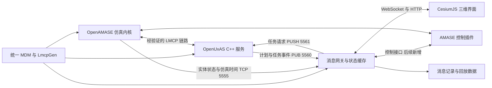

# 项目目录分析与 Windows／Cesium 改造计划

编制日期：2026-09-16  
分析对象：本仓库当前工作区，根仓库提交 `061685f`（`init`）。
文档性质：基于本地源码的现状分析与实施计划。本次仅形成文档，未安装依赖、修改业务代码、编译运行或完成联调。

实施补充（2026-09-18）：以上为编制时的分析基线；G0、G1 已完成，G1-T01～T05 均已完成，G2-T01 已完成，MSVC／SDK 及便携工具十组验收、两个生成器和两类路径下的 C/C++ 探针通过，T02 可执行、尚未启动，详见 [T01 记录](docs/g2-cpp-toolchain-validation.md)；阶段路线见 [G2 阶段方案](docs/g2-windows-uxas-plan.md)和 [七张任务卡](docs/backlog.md#4-g2-顺序与任务卡)。正式 AMASE、GUI／无界面真实 TCP 接收、十四组自动验收、人工确认、同版本受控复验及正常退出均通过，见 [T04 报告](docs/g1-amase-validation.md)、[T05 报告](docs/g1-tcp-validation.md)及 [当前状态](docs/status.md)。无界面闪屏／错误提示作了最小适配，实体 TCP 端口必须随实例隔离；已验证 AMASE→Python 接收，不据此宣布 UxAS／Cesium 或双向网络闭环完成。

## 1. 改造结论与范围

建议采用以下路线：**保留 OpenAMASE 仿真内核，保留 OpenUxAS 自主任务服务，将 Windows 原生运行能力补齐，再通过消息网关接入 CesiumJS，逐步替换原有态势显示与操作界面。**

当前工程已有较好的模块分工，也保留了部分 Windows 兼容代码；但它还不是一个可以直接在 Windows 上统一构建、启动和交付的平台。主要工作集中在 OpenUxAS 构建链、组件协议兼容、进程编排和可视化接口四个方面。

本文采用以下实施假设，后续可依据实际交付环境调整：

- 首期目标是 Windows 11 x64 单机开发与运行，最终交付不依赖 WSL、Docker 或 Linux 虚拟机；如果还需支持其他 Windows 版本，增加对应验收环境。
- Cesium 采用 **CesiumJS 浏览器前端**。后续如确有桌面安装包需求，再封装桌面壳。
- 首期用仓库已有示例完成联调；三维界面首先覆盖实体、轨迹、航线、任务、区域和仿真时间。
- 原 Java 界面在迁移期间作为核对工具保留，待功能覆盖及数据一致性通过后，默认启动无界面仿真与 Cesium。
- 前两份文档中的 TorchRL／BenchMARL 作为后续方向，本期为其保留接口，不同时开展训练框架集成。

CesiumJS 负责地理空间显示和交互；飞行运动、任务执行、传感器计算和仿真时间仍由后端承担。CesiumJS 的浏览器三维引擎定位可参见 [CesiumJS Fundamentals](https://cesium.com/learn/cesiumjs-fundamentals/)。

## 2. 当前目录结构与职责

### 2.1 根目录

以下为本次实际检查到的主要目录，省略了大量源码和示例文件：

```text
uav-autonomy/
├─ .git/                         根仓库版本管理
├─ .gitattributes                当前仅有 *.pdf binary
├─ 01.无人自主智能策略研发_思路与技术途径参考.md
├─ 02.OpenAMASE_OpenUxAS_TorchRL_BenchMARL_团队实施技术建议书与资源清单.md
├─ LmcpGen/                      LMCP 消息代码生成工具，Java／Ant
│  ├─ src/                       生成器源码和各语言模板
│  │  └─ templates/              cpp、java、py、cs、ada、rust 等模板
│  ├─ nbproject/                 NetBeans／Ant 项目配置
│  ├─ build.xml
│  └─ RunLmcpGen.sh
├─ OpenAMASE/                    仿真项目外层目录
│  ├─ README.md
│  ├─ AMASE Tutorial.pptx
│  └─ OpenAMASE/                 实际构建、配置与运行目录
│     ├─ src/
│     │  ├─ Core/                应用框架、事件、地图、地形、通用工具
│     │  ├─ Amase/               实体模型、仿真、任务分析、网络和界面
│     │  ├─ SetupTool/           场景编辑工具
│     │  └─ example/             示例插件及网络客户端
│     ├─ config/                 amase、amase_headless、playback、setup 等
│     ├─ run/                    Windows／Linux 启动脚本
│     ├─ lib/                    LMCP、WorldWind、SwingX、Flexdock、GRAL 等
│     ├─ data/                   图标、底图及相关运行资源
│     ├─ example scenarios/      示例场景
│     ├─ native/                 原生插件示例
│     ├─ docs/                   项目与协议文档
│     ├─ nbproject/
│     └─ build.xml
└─ OpenUxAS/                     自主任务服务，C++ 主线及独立 Ada 实现
   ├─ src/
   │  ├─ cpp/
   │  │  ├─ UxAS_Main.cpp        C++ 程序入口
   │  │  ├─ Communications/      LMCP、ZeroMQ、TCP、串口等消息桥接
   │  │  ├─ Services/            服务管理、分配、计划构建等
   │  │  ├─ Tasks/               具体任务服务
   │  │  ├─ Plans/               规划与几何计算
   │  │  ├─ Utilities/           文件、时间、日志、坐标等基础设施
   │  │  ├─ DPSS/
   │  │  ├─ Includes/
   │  │  └─ VisilibityLib/
   │  └─ ada/                    Ada／SPARK 实现与证明相关资料
   ├─ mdms/                      CMASI、UXNATIVE、UXTASK、ROUTE 等模型定义
   ├─ infrastructure/            构建与示例运行基础设施
   │  ├─ specs/                  Anod 依赖配方与上游仓库配置
   │  ├─ uxas/                   Python 构建辅助包
   │  └─ run_example.py           示例编排逻辑
   ├─ examples/                  HelloWorld、WaterwaySearch 等示例
   ├─ tests/                     C++ 测试、SPARK 证明检查
   ├─ external_libraries/        当前主要为 visibility_graph
   ├─ resources/                 辅助服务及工具资源
   ├─ doc/                       文档与参考资料
   ├─ Makefile                   当前 C++ 主构建入口
   ├─ anod                       Bash 构建包装脚本
   └─ run-example                Bash 示例启动包装脚本
```

本次文件清点中，`LmcpGen`、`OpenAMASE`、`OpenUxAS` 分别有 220、1,030、2,536 个可枚举文件；统计排除了 `.git`，包含文档、资源和部分随库二进制，不代表源码规模。

当前没有发现 `.gitmodules`，三个项目表现为根仓库下的源码目录。仓库中未发现现成的 Cesium／Web 前端、统一根构建入口或已实现的 TorchRL／BenchMARL 集成代码。前两份 Markdown 中的自研平台目录属于规划，不是当前已经存在的模块。

### 2.2 组件依赖关系

| 组件 | 当前职责 | 与改造的关系 |
| --- | --- | --- |
| LmcpGen | 根据 MDM XML 生成跨语言消息类与序列化代码 | 保留，作为 Java／C++／Python 消息版本一致性的源头 |
| OpenUxAS/mdms | 定义消息类型、字段、单位、继承关系与系列版本 | 作为协议基线，统一生成后端使用的消息库 |
| OpenAMASE | 推进实体状态、执行命令、计算仿真反馈，附带显示、编辑与回放工具 | 保留仿真，逐步将显示与操作迁出 Java 界面 |
| OpenUxAS | 按 LMCP 消息提供任务、分配、规划等服务 | 完成 Windows 构建与运行适配，维持现有业务能力 |
| 新增消息网关 | 当前不存在 | 接收 LMCP，维护场景状态，对浏览器提供 HTTP／WebSocket |
| 新增 Cesium 前端 | 当前不存在 | 三维场景显示、交互、时间展示及后续控制入口 |

构建依赖顺序应统一为：

```text
构建 LmcpGen
    → 用同一份 OpenUxAS/mdms 生成 Java／C++／Python 消息库
    → 构建 OpenAMASE、OpenUxAS 和消息网关
    → 构建 Cesium 前端
    → 打包配置、场景、运行库与启动脚本
```

现有 Anod 配方已经包含“生成 Java LMCP 库后提供给 AMASE”的动作，因此直接使用 `OpenAMASE/OpenAMASE/lib/lmcplib.jar` 而不核对版本，可能与重新生成的 C++／Python 消息库不一致。依据：[uxas-lmcp.anod](OpenUxAS/infrastructure/specs/uxas-lmcp.anod)、[amase.anod](OpenUxAS/infrastructure/specs/amase.anod)。

### 2.3 现有可视化的实际形态

当前默认界面由 Java／Swing 应用框架、地图插件、实体／航线／任务／区域图层及相关显示库组成，不能简单归结为一个可直接替换的三维控件。

主要入口是：

- [默认插件配置](OpenAMASE/OpenAMASE/config/amase/Plugins.xml)：注册 `WindowService`、`MapPlugin`、`SimControls`、`VehicleStateDisplay` 等。
- [地图源码目录](OpenAMASE/OpenAMASE/src/Amase/avtas/amase/map)：实体、命令、任务、区域等显示功能的迁移参考。
- [无界面插件配置](OpenAMASE/OpenAMASE/config/amase_headless/Plugins.xml)：关闭多项显示插件，保留实体、仿真时间、任务分析、场景输出、TCP 和地形模块。
- [TerrainService.java](OpenAMASE/OpenAMASE/src/Core/avtas/terrain/TerrainService.java)：使用 DTED 缓存提供高程和视线计算，属于仿真相关能力。

`lib/worldwind.jar` 仍被项目引用，且 `Core/avtas/shapefile` 使用其 Shapefile 类；即便迁走地图显示，也不能立即删除这个依赖。旧 WorldWind 缓存和 DTED 数据还需分别评估如何转换或提供给新的 GIS 显示链。

## 3. 已发现的问题与实施影响

下表中的“确认”指文件与源码层面的确认；没有将其表述为已完成的运行测试。

| 优先级 | 源码／目录证据 | 判断与改造影响 |
| --- | --- | --- |
| P0 | `OpenUxAS/README.md` 快速开始以 Ubuntu 为基础；`anod`、`run-example` 是 Bash | 当前主流程不能直接作为 Windows 原生部署流程 |
| P0 | `OpenUxAS/Makefile` 固定 `g++`、GCC 参数、Unix 命令和 `dl/pthread` 等链接项 | 需要补充 Windows 构建入口和按平台选择的依赖，不能仅将脚本后缀改成 `.bat` |
| P0 | UxAS TCP 桥使用 attributed message 与 Sentinel；T03 确认 AMASE 所用 Java 库也包含 Sentinel／属性封装 | 不再假定两端外层必然不同；仍须以真实双向流量验证分包、属性、来源与过滤，详见第 5 节 |
| P0 | `lib/lmcplib.jar` 随 AMASE 提供，Anod 又会重新生成和替换该库 | 必须统一 MDM、生成器与各语言消息库版本 |
| P1 | `runUxAS_WaterwaySearch.bat` 引用旧 `build/uxas.exe`；当前 Makefile 默认输出 `obj/cpp/uxas` | 构建输出路径与示例脚本需要统一 |
| P1 | `run/win/Common.bat` 使用当前目录相对跳转，并包含 splash 参数 | 从任意目录调用、无界面模式、包含空格或中文的路径都要验证 |
| P1 | `AMASE_3D.bat` 指向 `config/amase3d`，当前目录中未找到该配置 | 旧 3D 启动入口不应作为 Cesium 迁移的可运行基线 |
| P1 | 无界面配置启用 `ConstructiveControl`，其初始化完成后直接调用 `SimTimer.go()` | 必须处理网络客户端尚未就绪、初始配置已发布的启动时序问题 |
| P1 | `SimTimer.eventOccurred()` 接收 `SessionStatus` 时处理重置与设定时间 | 不能假定发送一个状态消息即可完成远程开始／暂停／倍速控制 |
| P1 | `LmcpObjectNetworkPublishPullBridge` 对导出消息的来源 EntityID 有过滤 | 订阅 UxAS PUB 端口不等于能收到所有 AMASE 状态；需逐类型核查 |
| P1 | WorldWind 类型仍用于 Shapefile 处理，地形服务仍用于仿真 | 界面替换、格式转换和仿真依赖清理应分阶段处理 |
| P2 | 当前 `.gitattributes` 仅声明 PDF 二进制；未发现已落盘的 `.gitignore` | 后续增加生成物忽略和按文件类型的行尾规则，避免构建产物与整库换行噪声 |

另有两个需要保留的判断边界：

1. C++ 已包含多处 `_WIN32` 分支，包括文件、时间、日志和通信相关代码，说明存在移植基础；这不能证明当前全部服务已在现代 MSVC 上通过编译。部分文件还混用 `WIN32` 与 `_WIN32`，构建定义应一致。
2. 本次当前 PowerShell 会话的 `PATH` 未解析到 Java、Ant、CMake、MSVC、Node／npm；`python.exe` 指向 WindowsApps。这里只能说明本会话尚未具备已确认的工具入口，不能据此断言整机未安装这些软件。

## 4. Windows 改造方案

### 4.1 路线选择

| 方案 | 适用目的 | 本项目建议 |
| --- | --- | --- |
| Windows 原生 Java＋C++＋Python＋浏览器 | 最终 Windows 开发、运行和部署 | 作为主线和最终验收目标 |
| Windows 前端＋WSL2 中的 UxAS | 早期复现 Linux 基线或临时解除 C++ 构建阻塞 | 可作过渡，但交付状态应明确标为混合运行 |
| 全部组件放入 Linux 虚拟机／容器 | 复现已有 Linux 流程 | 可作参考环境，不能替代原生 Windows 验收 |

首期范围限定为 **C++ UxAS 主线**。Ada／SPARK 工程有独立构建和证明链，应保留源码与既有工作流；若后续指定示例依赖 Ada 服务，再单独纳入 Windows 范围。

### 4.2 建议工具链与版本原则

| 对象 | 建议 | 版本与实现要求 |
| --- | --- | --- |
| Java | 先采用 JDK 11 兼容基线＋Ant | AMASE 配置为 Java 11，LmcpGen 为 Java 8；先验证同一 JDK 能否构建两者，再考虑升级 |
| C++ | Visual Studio C++ x64 工具链＋CMake；生成器采用 Ninja 或 VS | 明确运行库选项、Debug／Release、x64、DLL 与静态链接方式 |
| C++ 依赖 | vcpkg manifest 为候选管理方式 | 固定 baseline／版本与补丁；旧版本或缺失包使用受控源码构建／overlay port |
| 消息网关 | Python＋生成的 LMCP Python 库＋pyzmq＋FastAPI | 独立虚拟环境，锁定依赖；协议层不依赖 Web 框架 |
| 前端 | TypeScript＋CesiumJS＋前端构建工具 | 第一版可用轻量 Vite 工程；是否引入 Vue／React 由界面复杂度决定 |
| 启动编排 | PowerShell 入口＋Python 进程管理 | 路径、日志、端口和进程生命周期统一配置 |

这里给出的是候选工具链，不是已验证的版本组合。CMake Presets 可保存共享构建配置；vcpkg manifest 可声明项目级依赖并支持版本管理。参考 [CMake Presets](https://cmake.org/cmake/help/latest/manual/cmake-presets.7.html)、[vcpkg manifest 官方说明](https://learn.microsoft.com/en-us/vcpkg/consume/manifest-mode)。

### 4.3 LmcpGen 与 Java 消息库

1. 保留现有 Ant 构建，先在 Windows 构建 `LmcpGen.jar`。
2. 将 `OpenUxAS/mdms` 作为本项目约定的消息模型输入，分别生成 C++、Java、Python 输出。
3. 在独立生成目录中构建 `lmcplib.jar`，显式提供给 AMASE；避免 Java 类路径中同时出现多个不同版本的 LMCP 包。
4. 保存生成器版本、MDM 哈希、输出库哈希及生成命令。
5. 对代表性状态、命令、嵌套对象及列表做跨语言序列化与反序列化核对。

生成器自带 C++ CMake 模板，可作为 LMCP 库目标的起点，但它不是 UxAS 主程序的构建系统。模板中的旧 CMake 最低版本声明也需要和所选 CMake 版本一起检查。依据：[LMCP CMake 模板](LmcpGen/src/templates/cpp/CMakeLists.txt)。

### 4.4 OpenAMASE 的 Windows 适配

建议先保留 Ant 和现有源码组织，减少一次性调整的范围。

- 将构建工作目录固定为 `OpenAMASE/OpenAMASE`，验证 `ant jar`。
- 新启动器用自身文件位置计算项目路径，显式指定工作目录、Java 路径、类路径和场景路径。
- 分别提供 GUI 核对模式与无界面模式；无界面启动不带 splash，并验证 `-Djava.awt.headless=true` 是否能与当前依赖共同工作。
- 新增项目专用的无界面配置，控制插件、端口、场景和日志，不直接覆盖原始示例。
- 检查无界面执行过程是否还依赖窗口、弹窗和界面线程；错误应写入日志并产生可识别的退出状态。
- 将“完成初始化”和“开始推进仿真”分开。连接就绪前保持暂停，或提供完整初始快照的重发机制。

现有 `ConstructiveControl` 可用于批量自动运行，但其自动开始、结束后退出的行为需要与浏览器控制模式分开配置。

### 4.5 OpenUxAS 的 Windows 适配

这是工作量与不确定性最大的部分，建议按以下顺序实施：

1. **建立新 CMake 入口。**依据当前 Makefile 的源码集合建立目标，包含 `resources/AutomationDiagramDataService`；不要只扫描 `src/cpp` 而漏掉实际参与构建的源码。
2. **显式管理 LMCP 生成依赖。**MDM／模板变化能够触发重新生成；Java、C++、Python 使用同一份基线。
3. **补齐依赖。**当前配方涉及 libzmq、cppzmq、CZMQ、Zyre、pugixml、Boost、SQLite、SQLiteCpp 和 serial。
4. **先保持业务逻辑与依赖行为。**不要在移植时同时将全部旧依赖升级到最新；例如已有 ZeroMQ 包装代码使用旧 cppzmq API，需要配套验证。
5. **处理平台差异。**检查平台宏、文件路径、目录创建、UTC 时间处理、网络头文件、符号导出、系统链接库、退出与线程回收。
6. **按目标裁剪可选桥接。**单机基线不需要的 Zyre／串口可设置构建选项，但要同时处理桥接管理器中的头文件和实例化分支；仅从源码列表移除文件会留下链接问题。
7. **保留诊断能力。**输出版本、配置路径、实际监听地址、依赖版本和退出原因。
8. **运行现有测试和示例。**先 HelloWorld，再完整的 WaterwaySearch；适配 Bash 测试入口，并核对 Python 测试代码的平台假设。

源码级重点位置：[Makefile](OpenUxAS/Makefile)、[uxas.anod](OpenUxAS/infrastructure/specs/uxas.anod)、[桥接管理器](OpenUxAS/src/cpp/Communications/LmcpObjectNetworkBridgeManager.cpp)、[文件工具](OpenUxAS/src/cpp/Utilities/FileSystemUtilities.cpp)、[时间工具](OpenUxAS/src/cpp/Utilities/UxAS_Time.cpp)。

### 4.6 仓库和启动管理

- 新增根级 `.gitignore`，覆盖 `build/`、`out/`、生成消息代码、虚拟环境、`node_modules/`、日志、运行数据和依赖缓存。对随上游保留的 JAR／资源区别处理。
- 后续按文件类型设置行尾：Shell 脚本为 LF，批处理为 CRLF，源码／配置明确统一规则。避免与功能修改同时进行全仓库无关格式转换。
- 记录三个源码目录的上游来源与对应版本；根仓库的 `init` 提交不能代替上游版本记录。
- 检查 Anod 的源目录解析，确保参考构建使用当前根目录中的 LmcpGen／AMASE，而不是自动拉取另外一份 `master`／`develop`。
- 运行时使用独立的实例目录与端口配置；停止时只清理本次启动的进程，保留本次运行日志。
- 将进程存活、端口连接、消息解码成功、初始状态齐全作为不同就绪条件，不用固定等待几秒代替完整检查。

## 5. 消息协议与网关接入

### 5.1 现有端点与消息流

WaterwaySearch 配置中已存在以下接口，但配置存在不代表当前源码组合已经联调成功：

| 端点 | 当前配置角色 | 协议与用途 |
| --- | --- | --- |
| AMASE TCP `5555` | AMASE 服务端，UxAS 配置为客户端 | `TcpServer` 调用 Java LMCPFactory 的流读取与 packMessage(true)，当前实现含 Sentinel／属性外层；实际运行流量仍待核查 |
| UxAS TCP `9999` | 外部 TCP 服务端 | 当前 TCP 桥实现含 UxAS 属性封装和 Sentinel 分帧，应单独验证 |
| UxAS PUB `5560` | 外部客户端以 SUB 连接 | UxAS 地址／属性头＋LMCP 负载 |
| UxAS PULL `5561` | 外部客户端以 PUSH 连接 | 接收同类格式的外部消息 |

依据：[示例配置](OpenUxAS/examples/02_Example_WaterwaySearch/cfg_WaterwaySearch.xml)、[AMASE TcpServer](OpenAMASE/OpenAMASE/src/Amase/avtas/amase/network/TcpServer.java)、[Python 外部日志示例](OpenUxAS/examples/02_Example_WaterwaySearch/ext_logger/ext_logger.py)。上述端口只作首个实例的基线，多实例时通过配置分配；本机运行的新增接口默认绑定回环地址。

### 5.2 必须优先处理的 TCP 兼容问题

2026-09-17 的 G1-T03 已核查生成模板、随库 JAR 字节码和文件／内存样本。此前将 AMASE 方法名直接等同于原始 LMCP 流的判断不准确；更正后的调用链是：

```text
AMASE TcpServer
    → LMCPFactory.getMessageBytes / getObject / packMessage
    → Java 工厂读取 Sentinel；packMessage(..., true) 添加 Sentinel／属性外层
    → 外层内部为 LMCP 消息帧

当前 UxAS LmcpObjectNetworkTcpBridge
    → ZmqAttributedMsgSenderReceiver
    → AddressedAttributedMessage.getString()
    → MsgSenderSentinel / MsgReceiverSentinel
    → 带 Sentinel 的地址、属性和负载字节流
```

T03 在文件／内存中验证了 Java Sentinel 样本提取内部 LMCP 后与 Python 原始帧一致，以及两种语言的消息往返；没有启动 AMASE 或 UxAS。后续仍需抓取实际双向字节，核查外层长度、属性、流分包、校验和、来源与过滤，不能仅以“端口连通”判定成功。依据：[T03 验收](docs/g1-lmcp-validation.md)、[Java 工厂模板](LmcpGen/src/templates/java/lmcp_factory_java)、[TCP 桥](OpenUxAS/src/cpp/Communications/LmcpObjectNetworkTcpBridge.cpp)、[属性消息收发](OpenUxAS/src/cpp/Communications/ZeroMq/ZmqAttributedMsgSenderReceiver.cpp)、[Sentinel 发送器](OpenUxAS/src/cpp/Communications/ZeroMq/Senders/MsgSenderSentinel.cpp)。

优先验证现有 Java 库与 UxAS TCP 桥在固定消息版本下的真实兼容性，不再基于旧判断预先新增“AMASE 原始 LMCP TCP 模式”。只有实际证据显示需要适配时，才在 G3 确定专用桥或连接 AMASE `5555` 与 UxAS `5560/5561` 的适配器，并满足：

- 关闭旧的重复转发路径，明确各类消息的唯一来源。
- 按类型和方向转发，避免状态或命令在两端循环回送。
- 处理来源 EntityID、桥接导出过滤、初始消息丢失和连接重建。
- 最终固定一种部署拓扑，不能同时启用两条含义相同的主链路。

### 5.3 推荐网关结构

浏览器通过 WebSocket／HTTP 访问网关，由网关处理 TCP／ZeroMQ 和 LMCP。推荐将协议核心放入可复用的 `src/sim_bridge`，Web 服务放入 `apps/gis_gateway`，后续训练模块复用协议核心。



图中网关和控制插件均为拟建组件；AMASE 与 UxAS 的直连箭头以第 5.2 节兼容验证通过为前提。

网关应同时承担：

| 能力 | 实施要求 |
| --- | --- |
| 解码 | TCP 先按经实测确认的 Sentinel／属性外层分帧，再核对内部 LMCP 长度与校验；处理半包／粘包、未知类型和断线残包；ZeroMQ 按实际外层解包 |
| 状态缓存 | 保存最新实体、配置、任务、航线、区域与仿真状态，支持浏览器晚加入和重连 |
| 数据来源 | AMASE 为实体状态与仿真时钟的权威来源；UxAS 提供计划和任务服务消息，重叠消息按来源规则去重 |
| 场景初始化 | 网关在开始仿真前连接；一次性配置消息还需靠快照、重发或场景清单补齐 |
| 分发 | 初始快照＋后续增量；实体状态允许合并，关键命令／事件按序保留 |
| 控制 | 区分请求接收、后端接受、实际状态变化和失败，不把 WebSocket 发送成功当成仿真已执行 |
| 记录 | 同时保留原始消息、规范化数据、运行配置与版本，以支持问题定位和回放 |

现有 `ext_logger.py` 已展示 LMCP 与字典／JSON 转换，可复用其思路；其中 Python 消息库导入路径指向旧 `src/LMCP/py`，不能直接视为可运行网关。FastAPI 的 WebSocket 能力可用作接口实现基础，参见 [官方 WebSocket 文档](https://fastapi.tiangolo.com/advanced/websockets/)。

### 5.4 前后端数据约定

建议先定义版本化的 JSON 契约，避免将完整 LMCP 对象直接变成长期前端 API。

| 字段／对象 | 建议约定 |
| --- | --- |
| `schema_version` | 网关数据结构版本 |
| `run_id` | 每次仿真运行唯一，重新加载／重置时切换 |
| `sequence`、`snapshot_id` | 标识增量顺序和快照边界，支持检测缺口与重新同步 |
| `entity_id`、`task_id`、`command_id` | 对外以十进制字符串表示，避免 JavaScript 对 int64 ID 的精度损失 |
| `sim_time_s`、`received_at` | 分别表示规范化的仿真秒数与网关接收时刻，明确源时间基准 |
| `position` | `longitude_deg`、`latitude_deg`、`altitude_m`、`altitude_reference` |
| `attitude` | 保留源角度及坐标系定义；输出用于 Cesium 的转换姿态时注明模型轴校正 |
| `route`／`task`／`zone` | 持久对象按 ID 和版本更新，删除必须有显式事件 |
| `simulation` | 运行／暂停／结束、倍速、场景信息及控制状态 |

首次连接必须先拿到完整快照，再接续快照之后的增量。重连、重置与切换场景应清理旧对象和旧插值数据。快照边界与增量序号由网关统一生成，不要求修改全部原生 LMCP 类型。

## 6. Cesium 三维 GIS 替换方案

### 6.1 功能迁移清单

| 原有能力 | Cesium／Web 目标能力 | 实施阶段 |
| --- | --- | --- |
| 地图与背景图层 | 地球、底图、地形、图层开关、缩放定位 | 首版 |
| EntityLayer／实体信息 | 飞行器模型或图标、标签、状态面板、跟随视角 | 首版 |
| CommandLayer／航线 | 航点、计划航线、当前执行航段、实际轨迹 | 首版 |
| TaskLayer | 点／线／面任务、属性、关联实体和任务状态 | 首版先显示 |
| ZoneLayer | 可进入／禁入等区域、边界和高度范围 | 首版 |
| SimControls | 后端开始／暂停／倍速／重置按钮与状态反馈 | 控制阶段 |
| PlaybackTool | 记录选择、时间轴、暂停、拖动与倍速回放 | 回放阶段 |
| SetupTool | 场景选择、参数配置；后续点线面编辑和校验 | 先保留原工具，编辑另期实现 |
| 搜索分析与传感器显示 | 后端结果图层、可视范围／覆盖结果 | 基础替换稳定后扩展 |

首版范围结束时，Cesium 已能替代运行态势展示；完整替代还需要控制、回放和所需场景编辑功能覆盖，不能仅凭一个三维地球页面宣告替换完成。

### 6.2 首版实现方式

- 先用 `Entity`、模型、折线和多边形实现清晰的业务图层；压力测试后再决定是否改用批量 Primitive。
- 轨迹使用时间采样位置进行插值，限制历史窗口和采样数量；暂停、断流和结束时不能无限外推。
- 通过统一的对象注册表按 ID 更新对象，避免每次消息到来都重新创建全场景。
- 区分实时跟随与离线回放，两种模式共享渲染组件，但不共用控制状态。
- 基础 GIS 功能包含图层管理、实体查询、镜头定位、距离／面积量测与属性查看；是否需要三维量测另行明确。
- 独立部署 Cesium Workers、Assets、Widgets 等静态资源，确保开发模式与打包模式均可加载。

相关接口与资源要求见 [SampledPositionProperty](https://cesium.com/learn/cesiumjs/ref-doc/SampledPositionProperty.html) 和 [CesiumJS Quickstart](https://cesium.com/learn/cesiumjs-learn/cesiumjs-quickstart/)。实时首版使用 WebSocket JSON 更新；GeoJSON 可用于静态区域，CZML 可在需要时间序列导出时增加，不必将实时链路全部转成 CZML。

### 6.3 坐标、高度与姿态

这是验收重点，必须建立测试数据，不能靠目视“看起来差不多”。

1. **经纬度和单位。**本地 CMASI `Location3D` 使用 WGS84 经纬度，单位为度；高度单位为米。网关字段显式命名，Cesium 构造位置时按经度、纬度顺序传入。
2. **高度基准。**`Location3D` 默认 `AltitudeType=MSL`，但本地枚举注释将“WGS84 椭球高”与“平均海平面”混写，存在语义歧义。必须追踪 AMASE 实际计算和地形数据的高程基准，用已知点标定；不能仅凭字段名称给所有高度统一加上大地水准面修正。
3. **转换规则。**若确认源数据为正高，则按相应大地水准面模型转换成椭球高；若为 AGL，则先叠加相同基准的地面高程再转换。若数据源已经给出椭球高，不应重复修正。保留原始值与转换依据。
4. **姿态。**CMASI 航向参考真北，机体系和模型轴定义需与 Cesium 的局部参考系组合。按“北／东／南／西，俯仰，左右滚转”逐项验证；不直接照搬一组欧拉角。
5. **地形一致性。**Cesium 地形用于显示，AMASE DTED／高程服务参与仿真。二者采用不同数据时，可能出现贴地偏差或遮挡结果差异；应记录数据版本，明确显示与计算的责任。

依据：[CMASI.xml](OpenUxAS/mdms/CMASI.xml)、[EntityModel.java](OpenAMASE/OpenAMASE/src/Amase/avtas/amase/entity/EntityModel.java)。Cesium 位置构造高度与姿态变换的语义参见 [Cartesian3](https://cesium.com/learn/cesiumjs/ref-doc/Cartesian3.html)、[Transforms](https://cesium.com/learn/cesiumjs/ref-doc/Transforms.html)。

### 6.4 时间同步与控制

现有 CMASI `SessionStatus` 包含毫秒单位的 `StartTime`、`ScenarioTime` 和 `RealTimeMultiple`。AMASE 的 `EntityModel` 将 `ScenarioState.getTime() * 1000` 写入实体状态，因此不能把每个状态的 `Time` 都直接解释成当前 UTC。

实施时必须确定场景初始时间、实际发布值与绝对时间的映射，再配置 Cesium 时钟。实时浏览器时间跟随后端，可采用小幅显示延迟进行插值；仿真暂停时画面停止推进。切换场景或重置后重建时间轴，禁止混入上次运行样本。

控制建议新增一个薄的 AMASE 插件：

- 对外提供开始、暂停、倍速、场景状态查询等明确操作。
- 在仿真允许的线程／事件边界调用 `SimTimer` 等内部能力，避免网络线程直接改动仿真状态。
- 以请求 ID 跟踪完成和失败，浏览器根据后端反馈更新按钮状态。
- 重新加载／重置先采用可靠的受控进程重启和新 `run_id`，进程内快速重置作为后续优化。
- 同步单步推进虽可参考 `SimTimer.go(double)`，仍需验证完整执行边界与任务服务响应，不作为本期默认已具备能力。

### 6.5 在线／离线 GIS 数据

首版支持两种配置：联网数据源用于快速验证，本地数据源用于可交付的离线场景。

离线部署需明确准备前端资源、模型、影像与地形，并关闭默认在线搜索、底图和地形请求。旧 WorldWind 缓存不能直接当作 Cesium 瓦片目录，DTED 也需要转换或服务化；先以本地底图＋椭球地面验证整体链路，再加入经过校核的地形。

CesiumJS 可通过影像与地形 provider 配置本地服务，因此“离线 Cesium 页面”不必然要求部署 Cesium ion Self-Hosted。参见 [UrlTemplateImageryProvider](https://cesium.com/learn/cesiumjs/ref-doc/UrlTemplateImageryProvider.html)、[CesiumTerrainProvider](https://cesium.com/learn/cesiumjs/ref-doc/CesiumTerrainProvider.html)。

若离线三维地形是首期硬要求，应将数据格式、范围、精度、体量和转换工作纳入前置条件与工期。

## 7. 建议新增目录与文件改动点

### 7.1 增量目录规划

以下目录为拟建内容，本次没有创建实现代码。初期保留现有三个上游项目的位置，避免先做大规模搬迁。

```text
uav-autonomy/
├─ LmcpGen/                         保留
├─ OpenAMASE/                       保留，做必要的无界面／控制扩展
├─ OpenUxAS/                        保留，补充 Windows 构建与协议适配
├─ CMakeLists.txt                   统一 C++ 构建入口
├─ CMakePresets.json                Windows／Linux 预设
├─ vcpkg.json                       依赖声明，采用 vcpkg 时增加
├─ .gitignore
├─ docs/
│  ├─ architecture.md
│  ├─ windows-build.md
│  ├─ protocol-contract.md
│  └─ acceptance.md
├─ vendor-manifests/                上游版本、依赖版本及补丁清单
├─ cmake/                          UxAS 目标与平台依赖配置
├─ scripts/windows/                 环境检查、生成、构建、启动、停止、打包
├─ configs/                         平台、网关、端口、数据源配置
├─ scenarios/                       已冻结的项目示例与场景清单
├─ src/sim_bridge/
│  ├─ transports/                   AMASE TCP、UxAS ZeroMQ 连接
│  ├─ codecs/                       LMCP 与外层消息封装
│  ├─ state/                        场景快照、时间和对象状态
│  └─ recording/                    记录及回放读取
├─ apps/
│  ├─ gis_gateway/                  HTTP／WebSocket 服务
│  └─ cesium_viewer/                TypeScript＋CesiumJS 前端
├─ extensions/amase_control/        AMASE 控制插件及专用配置
├─ tests/
│  ├─ protocol/                     跨语言、分包和封装一致性
│  ├─ integration/                  进程、状态、控制与重连
│  └─ fixtures/                     固定消息和坐标／时间样本
└─ out/                             生成库、构建物、运行日志；不入库
```

后续增加训练模块时，可沿用前文规划加入 `src/torchrl_env`、`src/benchmarl_tasks`，复用 `sim_bridge`，避免另外建立一套 LMCP 解析和进程控制代码。

### 7.2 核心改动清单

| 文件／目录 | 计划改动 | 完成依据 |
| --- | --- | --- |
| 根 CMake、`cmake/`、版本清单 | 描述源码、生成依赖、第三方库和平台选项 | Windows 干净构建产生可运行 `uxas.exe` |
| `LmcpGen/src/templates/cpp` | 仅在所选构建环境要求时调整模板兼容性 | 重新生成的代码可直接构建，避免仅修改生成产物 |
| `OpenAMASE/OpenAMASE/build.xml`／`nbproject` | 使生成 LMCP 库路径可控，必要时加入控制插件 | 无重复消息类，Ant 构建可重复 |
| `OpenAMASE/OpenAMASE/config` 与启动器 | 提供受控无界面配置，拆分初始化与开始运行 | 不打开旧界面也能接收状态并完成控制 |
| `OpenUxAS/src/cpp/Communications` | 校正 AMASE 协议兼容、来源过滤和可选桥编译 | 真实双向消息通过，关闭时不因阻塞收包挂住 |
| `OpenUxAS/src/cpp/Utilities` | 按编译与测试结果修复 Windows 差异 | 路径、时间、日志相关检查通过 |
| `scripts/windows`／`configs` | 统一输出路径、工作目录、就绪检测和日志 | 从不同工作目录启动，重复启停无残留 |
| `src/sim_bridge`／`apps` | 网关和 Cesium 接入 | 实体、任务、航线、区域与时间显示一致 |
| `tests` | 固定协议、集成与显示变换的回归样本 | 可重复核对迁移结果，不依赖手工观察 |

## 8. 分阶段实施计划

以下工作量为初步估算，假设 2～3 名具备 C++／Java、Python、Web GIS 经验的开发人员参与，现有小场景作为验收基线。总排期约 **8～12 周**；P0 结束后重估。完整场景编辑、大规模离线数据生产、Ada 移植及强化学习集成不包含在此估算中。

| 阶段 | 参考工期 | 主要任务 | 交付与退出条件 |
| --- | --- | --- | --- |
| P0：基线与协议核查 | 2～4 个工作日 | 记录版本与工具链；构建生成器／Java；确认消息库；验证 TCP 封装；冻结测试场景 | 形成依赖清单、协议样本、阻塞清单，确定 AMASE↔UxAS 唯一连接方案 |
| P1：Windows 原生运行 | 2～3 周 | CMake／依赖、必要平台修复、Java 无界面配置、脚本和进程管理 | Windows 原生运行 HelloWorld、AMASE 场景及 WaterwaySearch 完整链路，保存日志 |
| P2：消息网关 | 1～2 周 | 生成 Python 消息库、解码、快照、增量、时间、记录、重连 | 可通过接口取得与源消息一致的实体／任务／航线／区域数据 |
| P3：Cesium 态势首版 | 1～2 周 | 地球、图层、模型、轨迹、区域、状态面板、镜头与时间 | 实际仿真驱动三维显示，完成坐标／姿态／时间核对 |
| P4：控制与回放 | 2～3 周 | AMASE 控制插件、开始／暂停／倍速／重置、回放时间轴 | 后端控制状态一致，记录可重复回放，默认操作不依赖旧显示界面 |
| P5：打包与验收 | 约 1 周 | 静态资源、本地数据配置、运行库、完整部署包、回归与手册 | 在干净 Windows 环境按文档完成部署与运行 |

P1 期间，前端可用固定消息样本建设图层；P2、P3 可以部分重叠。协议未验证前，不能把模拟数据驱动的前端标为端到端集成完成。

若 P0／P1 表明 Windows C++ 原生构建受旧依赖严重阻塞，可以短期使用 WSL2 完成界面联调，但保留独立的原生适配任务与验收记录。

### 8.1 首批可直接拆分的任务

1. 建立版本／依赖清单和环境检查脚本，确认本机真实可用的工具链。
2. 构建 LmcpGen，用当前 MDM 统一生成三种语言的消息库。
3. 构建 OpenAMASE，分别验证 GUI 和无界面场景，记录 `5555` 消息样本。
4. 增加 UxAS CMake 最小构建，优先运行 HelloWorld。
5. 完成 AMASE／UxAS 双向协议验证，修复或增加明确的兼容桥。
6. 固定 WaterwaySearch 场景、实例目录、端口与启动顺序，记录状态和规划输出。
7. 建立最小网关，先提供实体快照和实时位置，再逐步增加任务／航线等对象。
8. 建立 Cesium 页面，使用同一场景核对位置、姿态和仿真时间。

## 9. 验收标准

### 9.1 Windows 构建与运行

- 在已声明的 Windows x64 工具链下，从干净源码和锁定依赖可重建，主流程不调用 WSL／Bash。
- `LmcpGen.jar`、Java LMCP 库、`OpenAMASE.jar`、C++ LMCP 库、`uxas.exe`、Python 消息库与前端产物均可追溯到同一基线。
- 从根目录和其他工作目录均可启动；包含空格、中文的路径至少验证一次。
- 连续启动／停止 10 次，无端口占用残留、孤立进程或日志被误删。
- 缺失依赖、配置错误、端口冲突、子进程提前退出时有可定位的错误信息。

### 9.2 协议与集成

- Java／C++／Python 对固定样本的消息类型、字段、列表与时间单位解析一致。
- AMASE↔UxAS 双向消息均验证；TCP 半包、粘包、断线重连和非法长度能被正确处理。
- 明确证明实体实时状态和任务／航线消息均到达网关，不能只看到 UxAS 注入的初始状态消息。
- 浏览器晚连接、刷新、网关重连后能恢复完整场景，删除和重置不留下旧实体或旧任务。
- 命令只进入约定通道一次，没有循环转发；请求 ID 与实际状态反馈可以关联。

### 9.3 显示与时间

- 原始消息、网关对象和 Cesium 地理坐标相互可核对；首期建议转换误差目标不超过 1 米，具体根据源数据精度确定，不以屏幕像素测量替代。
- 通过四个基本航向和俯仰／滚转测试，模型朝向正确。
- 同时保存计划航线和实际轨迹，能够区分二者。
- 运行、暂停、倍速、结束和重置时，Cesium 时钟与后端状态一致。
- 回放拖动后恢复该时刻完整对象状态，不能只跳转相机或实体位置而遗漏任务／区域变化。
- 离线模式在断网条件下仍能加载声明的地图、模型和页面资源。

### 9.4 初步性能目标

以下数值是建议起点，需要固定测试机、浏览器、模型复杂度和地形配置后确认：

| 项目 | 建议目标 | 测量约定 |
| --- | --- | --- |
| 稳定性 | 连续运行 30 分钟 | 内存和待发队列有界，关键事件不丢失 |
| 小规模实时显示 | 10～20 个实体，常用视角约 30 FPS 或更高 | 区分真实源更新率、网关推送率与浏览器渲染率 |
| 网关到界面延迟 | 实时模式下 P95 ≤ 250 ms | 从网关收到可解码消息到浏览器应用更新；不包含源采样周期 |
| 断流表现 | 明确显示数据过期，停止无界外推 | 网络恢复后重新同步快照和时间轴 |

原配置中的仿真帧率与 `SessionStatus` 发布率并不相同，实体自身也有发布逻辑；不能据 `FrameRate=30` 宣称前端已经获得每实体 30 Hz 状态。

## 10. 风险与下一阶段决策点

| 风险／未定项 | 影响 | 应对 |
| --- | --- | --- |
| 三个源码目录的上游版本未对齐 | 消息协议、配置和依赖可能不配套 | P0 固定来源和版本，建立跨语言消息样本 |
| TCP 封装差异 | 状态与命令无法互通，界面只能显示假数据 | 优先验证与修复协议，保留独立的封装测试 |
| 老 C++ 依赖的现代 MSVC 兼容性 | 拉长原生移植工期 | 先最小依赖构建，可选桥设开关；必要时保留临时混合运行环境 |
| 无界面仍含界面依赖或自动开始 | 启动失败、初始状态丢失、无法稳定控制 | 受控初始化、消息快照、错误日志和独立控制插件 |
| 高度与时钟语义不统一 | 地形穿透、模型漂移、暂停／回放错误 | 用已知点和时间样本校核，显式保留基准信息 |
| GIS 显示逐渐承担仿真计算 | 换底图或掉帧影响业务结果 | 仿真与分析以服务端结果为准，显示层只表达已定义数据 |
| 完整场景编辑范围扩大 | 影响首期交付 | 首期保留原 SetupTool；新编辑器按能力清单另行评估 |
| 离线数据范围不清楚 | 数据转换与部署体量超出预期 | 在 P0 确定区域、精度和数据格式；先最小本地资源验证 |

实施开始前最需要明确的参数是：最终 Windows 版本范围、是否必须完全离线、首期实体规模、是否要求在浏览器中编辑场景。这些参数影响验收矩阵和工期，不影响先完成版本固定、协议核查与基础构建工作。

本期完成的标志是：**在目标 Windows 环境启动 OpenAMASE 与 OpenUxAS，通过真实消息驱动 Cesium 显示，并可从新界面控制和回放已验收场景，形成可重复部署的工程与运行手册。**
