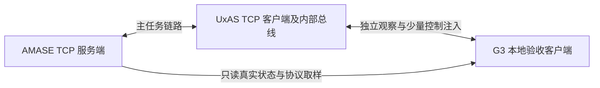

# G3 → G4 接口与证据交接

日期：2026-09-19。**G3 已完成。合格阶段运行为 `g3-t07-test-20260919-173116-474`，本轮 GUI 确认及正常退出已通过。** 本文整理可复用接口；阶段事实以 [T07 报告](g3-stage-validation.md) 和最终合格收据为准，G4 尚未实施。

## 1. 唯一配置与使用入口

连接配置为 [config/g3-startup.json](../config/g3-startup.json)；执行关联配置为 [g3-execution.json](../config/g3-execution.json)，全任务配置为 [g3-completion.json](../config/g3-completion.json)，阶段策略为 [g3-acceptance.json](../config/g3-acceptance.json)。四份文件分别控制范围，不是四套互相竞争的连接方案。本轮 `out/runs/g3-t07-test-20260919-173116-474/handoff.json` 绑定四者摘要、同批消息、正式 AMASE／UxAS 身份及实际运行副本摘要。

消费前重新运行 `check-g3-baseline.ps1` 或让验收入口自动完成当前资格检查。正式 UxAS 使用 `Resolve-UxasPackage`，AMASE／消息／输入依照 G3 基线逐项核对，不直接拼接历史 EXE／JAR 路径。来源改变后按影响复验，不通过改写旧清单接受变化。

```powershell
$pythonExe = Join-Path $env:LOCALAPPDATA 'Python/pythoncore-3.14-64/python.exe'
powershell.exe -NoProfile -ExecutionPolicy Bypass -File .\tests\windows\g3-acceptance.tests.ps1 -PythonExecutable $pythonExe -StabilityRunId g3-t06-test-20260919-164024-586
```

该入口需要本次 GUI 审查／确认收尾，完整步骤见 T07 报告。旧 T03 启动与 T04 短程入口可做各自范围的验证，不能据其结果宣称新一轮完整任务通过。

## 2. 拓扑、端口与消息方向



AMASE 与 UxAS 主链路双向直连。观察客户端订阅另一条 UxAS TCP 连接，并只读连接 AMASE；收到的消息不再回送。端口配置显式且所有者可核查，冲突即失败，不静默换端口或结束占用者。

| 模式 | AMASE 主 TCP | 实体 400／500 | UxAS 观察 TCP |
| --- | --- | --- | --- |
| GUI | 5555 | 9400／9500 | 9999 |
| Headless | 5556 | 19400／19500 | 9999 |

两模式顺序运行，共用观察端口 9999，不能将默认配置直接并行启动。T06 半帧故障的 5557 是测试转发器专用端口，不属于正式主拓扑。原例 PUB 5560／PULL 5561 不是本次主连接或完整状态来源。

| 路径／消息 | 来源与过滤 | 消费约束 |
| --- | --- | --- |
| AMASE → UxAS：配置、真实状态、SessionStatus 等 | 外层 source entity/service 为 0/0；payload 实体身份为 400／500 | 不能混淆路由来源和业务实体；以本轮真实动态状态满足初始化 |
| UxAS → AMASE：MissionCommand、LineSearchTask、VehicleActionCommand、KeyValuePair | 主桥 ConsiderSelfGenerated=false、ExportOnlyLocalMessages=true | 保留来源，拒绝回路；接收／规划／实际执行分别关联 |
| UxAS → 观察客户端 | 观察桥 ConsiderSelfGenerated=true、ExportOnlyLocalMessages=false，订阅 afrl.／uxas. | 完整观察，不以 PUB 过滤结果代替全量状态 |
| 编排 → 观察桥 → 内部总线 | 注入 EntityID／ServiceID=900/1；桥改写为 EntityID=100、Group=TcpBridge，ServiceID 为该桥身份 | 本次任务、请求和关闭按屏障发送；自身注入可能无回显，须查原消息日志 |

运行副本保留原例对照，移除 SendMessagesService 以防重复启动任务；主桥与观察桥配置差异保存在每模式 `uxas/uxas.xml`，原 XML 不修改。G4 应决定自己的连接／控制权限并独立验证，不复制本地验收注入身份作为通用生产接口。

## 3. 封装、样本与证据索引

网络为 Sentinel／属性外层加内部 LMCP，严格校验长度和两层校验和；Python 工厂的原始 LMCP 不能直接等同于网络帧。解析必须保留未消费尾部、累计偏移和 EOF 残包诊断，不把一次 recv 当作一帧。生成工厂宽松接受零校验和不构成网络输入校验。

T02 实测 Java 生产接收器拒绝坏外层帧并关闭连接，C++ 真实后端拒绝坏外层长度／校验和；内部 LMCP 坏帧的拒绝由严格验收解析器反例保证，未宣称所有 C++ 接收路径均具备该防线。G4 网关入口须独立保留严格校验并验证，不能从“合法帧互通”推导“任意畸形输入都已安全拒绝”。

| 证据 | 位置与用途 |
| --- | --- |
| 双向与来源样本 | `out/runs/g3-t02-verify-20260919-104721-817/`；具体案例、原始帧、来源／PUB 过滤见 [T02 报告](g3-protocol-validation.md) |
| 当前全任务真实消息 | `g3-t07-test-20260919-173116-474` 的 headless／gui 子目录；observer／amase JSONL、原始 TCP 字节与索引、AMASE 事件、UxAS 原消息日志 |
| 完整执行／覆盖 | 每模式 case-result.json、completion／coverage 结果、amase/analysis.xml、amase/coverage-cells.xml、uncovered.csv、amase/analysis-events.tsv、replay-*/pixels.csv，以 evidence 清单中的实际路径为准 |
| GUI 本轮审查 | gui/review/、gui-ready.json、request-gui-acceptance.json；审查前自动通过与确认后正常退出分别留证 |
| 故障与整组恢复 | `out/runs/g3-t06-test-20260919-164024-586/` 的子运行索引、disconnect-check.json、isolation-checks.json、source-faults.json |
| 当前资格与阶段交接 | T07 的 prior-receipts.json、preservation-before／after.json、result／entry-result／acceptance／handoff.json |

原始运行物由 `.gitignore` 排除，不将大批二进制日志提交为源码。报告记录身份与关键结果，跨机器移交证据须一并提供被收据引用的目录并复核摘要，不能只复制一个 passed JSON。

## 4. 初始化、完成与时间语义

启动顺序固定：资格及端口 → AMASE 暂停 → UxAS 主桥和观察桥可解析 → 单次启动 → 两实体配置及至少五条时间递增、位置变化的真实状态 → 单次任务 1000 → TaskInitialized → 单次原 AutomationRequest → 分配／规划／分段命令／实际导航 → 完整末端／TaskComplete → 统计及正常退出。

当前任务分配给 400，500 保留真实状态并巡航；不能要求未分配实体执行任务，也不能把初始巡航当成规划结果。分段和四点重叠为原实现行为，须结合内部导航观察网络采样间的目标变化。完成必须同时绑定任务、分配实体、全部任务目标、真实末段到达及唯一同源 TaskComplete；消息到达本身不代表完成。

| 数据 | 当前核实的含义 | G4 处理要求 |
| --- | --- | --- |
| AirVehicleState.Time | 仿真毫秒 | 保存原单位与运行身份，不转换为 UTC |
| TaskActive.TimeTaskActivated／TaskComplete.TimeTaskCompleted | UxAS Test_SimulationTime 使用状态驱动的离散仿真毫秒 | MDM 仍注释为 UTC 毫秒；本运行以实际时间源为准，可能晚于内部连续到达时刻，按同任务／实体状态链验证 |
| SessionStatus | 真实运行／暂停状态及倍率 | 不是任意写入即可生效的通用控制 API；浏览器时钟跟随后端 |
| 墙钟 | 启动、超时与运行耗时 | 与仿真时间分栏保存；人工等待单独计时 |
| int64 ID／时间 | 对外保存十进制字符串 | 避免 JavaScript 整数精度损失 |
| 经纬度／高度 | CMASI 经纬度为度，高度为米 | 保留高度基准，真实地形与姿态映射仍需后续核实 |

当前两模式固定实际 1 倍，原场景 785 秒；初始化、任务初始化、规划和关闭各 30 秒，自动全程预算 2700 秒。人工等待期间保持暂停，不自动成功；暂停、重置、场景切换及重放分段应在 G6 明确建立。

## 5. 已有恢复范围与 G4 待办

T06 已验证真实半帧断线：完整 26 帧之后在偏移 10037 截断实体 400、4709 仿真毫秒的一条真实状态帧，579 字节仅发送 289 字节。当前运行明确失败、残包未进入 UxAS，整组停止并释放端口；新编号、新 PID／就绪标识、零偏移与零时刻重新初始化、规划并实际执行。原失败记录保持。

这只证明整组重启恢复。G4 仍须细化并实现：

1. 版本化浏览器协议、初始快照与有序增量、实体／任务／命令生命周期及删除。
2. 网络自动重连、快照补齐、跨运行隔离、重复／乱序处理和完整恢复矩阵。
3. 后端时间映射、暂停反馈、状态过期与连接状态；浏览器掉帧不影响仿真。
4. 严格解析、来源／转发白名单、日志记录与受控进程接口的复用边界。

首期可继续评估 Python 网关，但本卡未选定新依赖或实现 gateway。涉及中文业务字段时先修复生成器／模板的字符串字节长度并按同批来源重新验收；中文运行路径通过不能证明任意 Unicode 字段可用。零高程缺省不能证明真实地形覆盖正确。Cesium 归 G5，运行重置分段归 G6，正式记录回放归 G7，第二机器与指定断网演示归 G8。覆盖效果和算法／参数寻优另立后续任务。

本轮机器交接摘要：`B173FE908E612470CAB35652C3EA8409A293D039960124BE4BA2D168BD4C4BD3`。两模式实际覆盖均为 724／724 与 724／724，分别逐格复算通过；该数值没有最低验收门槛。使用本轮收据集合复核，后续配置／来源改变时重新验收。
