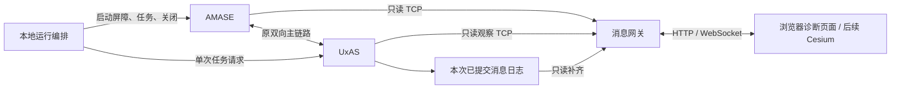

# G4 实施方案：消息网关、观察链路恢复与 20 实体混合任务

日期：2026-09-19，Asia/Shanghai。用户已确认本方案。**G4 已细化；实现与验收状态以 [status](status.md) 和 [任务卡](backlog.md#8-g4-顺序与任务卡) 为准。** 截至 2026-09-20，T01～T09 已完成，合格网关已发布，见 [阶段报告](g4-stage-validation.md)和 [G5 交接](g4-g5-handoff.md)。G3 历史结果见 [阶段报告](g3-stage-validation.md) 与 [交接](g3-g4-handoff.md)。

## 1. 目标与边界

先通过原两实体 WaterwaySearch 的网关闭环，再扩展到 20 架真实 AMASE 实体，每架一个独立任务：6 个点搜索、8 个线搜索、6 个矩形区域搜索。固定实体与任务对应关系，由 UxAS 实际规划并执行，逐架验证完成。

恢复覆盖浏览器重连、整个网关进程重启、两路观察连接分别或同时断开及语义补齐。后端退出或 AMASE↔UxAS 主任务链路故障时明确失败，使用新运行编号整组重启；不续跑已经退出的后端。浏览器关闭、掉帧或网关恢复不得控制仿真或重复注入任务。

20 实体在 GUI／无界面分别以实际 1 倍运行 1800 仿真秒、连接三个客户端；内存及队列有界、关键事件完整是硬条件。记录更新率和延迟，不设 250ms 门槛。不设最低覆盖率或观察时长，不开展算法、飞行参数或覆盖效果寻优。

G4 浏览器接口只读；Cesium 归 G5，交互控制和重置分段归 G6，历史时间轴回放归 G7，第二机器和断网部署归 G8。零高程缺省不代表真实地形；业务 LMCP 字符串沿用 ASCII，中文诊断页面和中文路径另行验证。

## 2. 当前依据与技术路线

规划只读核查起点为 `d07207e`，工作区干净。Python 3.14.7 x64 可用，FastAPI／Uvicorn／Pydantic／websockets 尚未安装。正式产物和工具在 T01 重新核查，历史编号不永久有效。

源码确认 AMASE TcpServer 和 UxAS TCP 观察桥只发送连接后的消息，没有历史快照重发。G3-T07 实际日志 `headless/uxas/datawork/SavedMessages/messageLog_1_0.db3` 有 6834 条连续记录，包含真实配置、状态、任务、规划、命令、完成及来源；这只证明历史内容齐全，在线读取及恢复一致性须在 G4 验证。UxAS 日志每条使用独立事务提交，读取必须短事务、只读、分批，不长期持锁。

保留主双向链路，网关只读连接 AMASE TCP 与 UxAS 观察 TCP；不采用原例 PUB 作为全量来源，不引入 pyzmq。运行编排独立管理后端、任务屏障和正常关闭，网关进程可单独退出或重启。

协议核心置于 `src/sim_bridge/`，Web 服务置于 `apps/gis_gateway/`；不把既有验收客户端直接作为生产网关，不保留其无界 rows 列表。采用 Python 3.14.7、FastAPI、Uvicorn、Pydantic v2、websockets，独立项目环境，T01 锁定完整依赖及文件哈希。FastAPI 的 [WebSocket](https://fastapi.tiangolo.com/advanced/websockets/) 和 [Python 3.14 支持](https://fastapi.tiangolo.com/release-notes/) 不等于本项目组合已验收。

### 2.1 端口、来源与权限

沿用 G3 两模式连接端口：GUI 的 AMASE 5555、实体 9400／9500；Headless 的 AMASE 5556、实体 19400／19500；UxAS 观察口 9999，两模式顺序运行。网关默认 `127.0.0.1:8000`。20 实体的全部端口在独立配置中显式登记。端口冲突即失败，不自动换端口或结束占用者。

AMASE 权威提供实体配置、真实状态和 SessionStatus，UxAS 提供任务、分配、规划及命令事件；路由 source EntityID 与 payload 实体 ID 分开保存。主桥保留 G3 来源与回路过滤；混合场景仅在运行副本追加 PointSearchTask／AreaSearchTask 导出白名单。浏览器和网关不转发业务输入，不提供任意 LMCP 注入接口。

### 2.2 v1 浏览器契约

| 接口 | 约定 |
| --- | --- |
| `GET /api/v1/health` | 本次运行、初始化、连接、补齐、记录及故障状态；进程存活不等于 ready |
| `GET /api/v1/snapshot` | 实体、三类任务、规划航线、当前命令、区域、仿真状态及一致的边界 |
| `WS /api/v1/stream` | 同连接先快照，再发送快照边界后的有序增量；浏览器重连重新取快照 |
| `/` | 无 Node 构建依赖的诊断页；真实对象、任务、时间、连接及刷新／重连对照 |

消息有 `schema_version`、`run_id`、`stream_id`、序号和源时间。所有 int64 ID、时间和序号为十进制字符串；仿真毫秒不解释为 UTC，接收墙钟单独保存。新后端运行更换 run_id；网关重新构建发布流更换 stream_id，使旧增量不可混用。

快照与增量使用同一状态归约器。新增、更新、删除显式表达；完成不等于删除，过期不等于删除。命令收到、实体实际执行及后端报告完成分别表达。经纬度为度、高度为米并保留原基准，姿态保留源单位／参考系，G4 不做 Cesium 轴转换。

### 2.3 严格输入、持久记录与恢复

严格检查 Sentinel／属性／内部 LMCP 的长度、校验、类型与版本，接收有界；每次连接独立缓冲及偏移，保留 EOF 残包诊断。非法输入不进入状态，不用生成工厂宽松校验代替网络防线。

保存原始收包、解码和规范化事件、运行配置、来源及缺口。关键任务、命令和生命周期事件以当前 UxAS 已提交数据库的分片身份和行号排序／去重，原观察 TCP 用于真实接收及来源对照；实时实体状态按 AMASE 权威来源更新。日志补齐是语义补齐，不伪造缺失 TCP 字节。

网关启动或观察连接恢复时，核查后端 PID／创建时间、运行清单和日志身份，打开新解析器并缓存有界实时输入，重建到明确提交边界，发布新快照后接续增量。补齐中标记 recovering；日志缺失、损坏、读取不完整或来源身份变化时不发布完整且实时的快照。主任务链路故障和后端退出不按观察连接恢复处理。

每客户端待发队列和内存历史有上限；实体更新可合并，关键事件持久保留。慢客户端溢出后断开并要求新快照，不静默遗失关键事件，不反压主任务。记录完整历史保存在磁盘，G4 不提供回放时间轴。

## 3. 顺序任务与独立交付

一次只推进一个主要实现任务，前置未通过不进入下一卡。每卡先验证、追加工作日志、同步状态，再按持续授权提交、普通推送及核对远程。

| 任务 | 前置 | 主要交付与通过条件 |
| --- | --- | --- |
| G4-T01 输入、环境与契约 | G3 完成 | 正式来源复核、独立 Python 环境、完整依赖锁、配置与 v1 契约；安装／导入及 HTTP／WebSocket 冒烟 |
| G4-T02 协议核心与真实接入 | T01 | 有界严格解码和真实两路接收；两实体与 UxAS 样本对照、分包／坏帧／残包拒绝 |
| G4-T03 状态模型与持久记录 | T02 | 三类任务等对象、时间、删除、只读日志与确定性重建；旧运行／重复事件拒绝 |
| G4-T04 浏览器接口 | T03 | HTTP／WebSocket／诊断页；快照边界、多客户端、刷新与慢客户端隔离 |
| G4-T05 自动重连与补齐 | T04 | 两观察连接、整个网关和浏览器恢复；关键事件补齐及日志／后端故障拒绝 |
| G4-T06 两实体完整验收 | T05 | 原例两模式全程；执行、可靠完成、覆盖正确及正常退出，浏览器故障不影响主任务 |
| G4-T07 混合任务资格 | T06 | 点／线／矩形各一独立小场景及三实体混合；实际规划完成、请求隔离及统计语义 |
| G4-T08 二十实体扩展与稳定性 | T07 | 固定 20 实体混合场景；逐架完成，两模式各 30 分钟、三个客户端及恢复／资源矩阵 |
| G4-T09 阶段验收与 G5 交接 | T08 | 最终来源／全程复验、当前 GUI 确认、正常退出、合格发布、接口及证据交接 |

详细目标、修改范围、证据、回退和停止条件见 [九张任务卡](backlog.md#8-g4-顺序与任务卡)。以上接口和入口在实际落地并通过前都是规划，不列作已验证标准命令。

## 4. 混合场景与验收

两实体原例保持 400／500、任务 1000、原 90 点水道、785 仿真秒和 20 米栅格。20 实体独立副本采用 400、500、600～617，按清单前八架线搜索、随后六架点搜索、最后六架矩形区域搜索，固定一架一任务。线任务完整几何、初始位置和巡航随固定网格整体平移；点／区域复用原 CMASI 示例结构，矩形 1000×500 米；明确为功能测试地理布置。

实体真实初始配置及至少五条时间递增、位置变化的状态齐全后，逐项发送任务、等待 TaskInitialized、发送单实体单任务请求、关联非空规划响应，再处理下一项；实际执行并行。源码 CMASI AutomationRequest.EntityList 的上限为 16，本方案不修改模型或绕过此限制；为每架实体配置航点管理服务，并验证后续请求不覆盖已执行计划。

细化时点和区域仅有源码／示例；T07 后续已通过三类单例及混合实际执行，T08 已通过 20 实体两模式全程。逐任务完成依据为真实规划、命令、内部导航、实际任务航段及正确身份 TaskComplete；不以消息数量或发送成功替代。线／区域分别报告覆盖计数和百分比，点报告观察秒数，独立对照分析记录；不混用统计单位或设置效果门槛。

20 实体每模式实际 1 倍运行到 1800 仿真秒，任务结束后保持后端终端行为，继续真实状态采样。每模式自动预算 2700 墙钟秒，人工等待单独计时。记录本机规格、源采样率、发布率、延迟分位数、队列峰值、内存、CPU 和日志体积。

| 类别 | 必验项目 |
| --- | --- |
| 协议 | 两层长度／校验和、半包／粘包、超限／未知类型、非法数值、超大 ID、断线尾部 |
| 一致性 | 快照期间增量、重复／乱序、删除后恢复、权威来源、跨运行隔离、同记录确定性重建 |
| 恢复 | 晚加入／刷新、慢客户端、两路分别及同时断线、半帧、整网关重启、日志缺失／损坏、后端退出 |
| 任务 | 原两实体全程、三类单例与混合、20 架逐项请求且并行真实执行、每架完成、统计正确 |
| 稳定性 | 两模式各 30 分钟、三个客户端含刷新／慢消费、内存与队列有界、关键事件不丢 |
| 运行 | 普通／中文空格路径、其他工作目录、依赖缺失、端口冲突、重复启停、正常退出／端口释放 |

## 5. 完成、变更与回退

收据区分 configured／qualified／passed／failed／awaiting-gui，不把文档、编译、模拟夹具或短程运行写成完整阶段通过。正式包、输入清单与历史证据保持；修改业务源码或生成器时按影响重建并重新发布，不能改写旧哈希。

T09 要求本轮真实 GUI 确认绑定运行身份与审查结果；自动审查或历史确认不能代替。正常关闭、端口释放、全部任务证据和来源复查通过后才发布网关并登记 G4 完成。失败保留记录和旧合格包，只回收本次所属进程；范围外能力继续登记后续关卡。

本次 T09 收尾保留用户实际查看的 GUI 确认：原运行审查后推进 1030 ms，冻结检查 failed 且正常关闭，原结果未改判；另以相同候选包完成全部 20 实体受控 GUI 复验、正常退出和独立关闭后审计。真实视觉确认与受控运行分别绑定，不声称用户重新查看了后者。正式日常入口另行验证网关停机／自动重启期间后端继续推进，见阶段报告。
