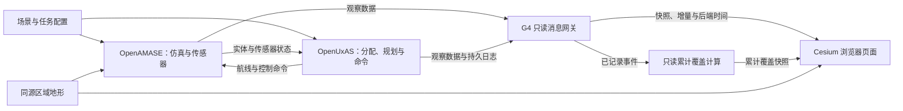
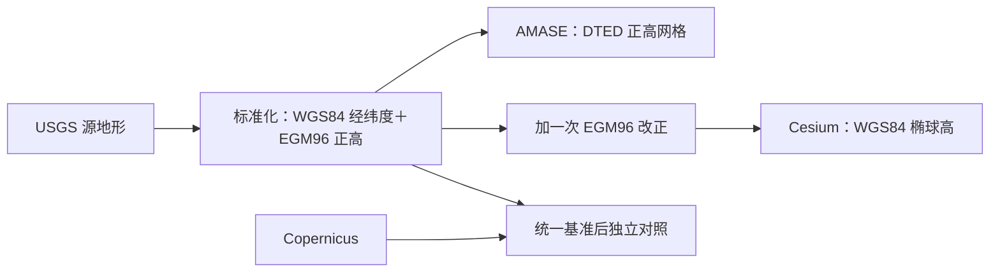

# 无人系统仿真项目整体说明与界面使用指南

更新日期：2026-09-22。适用对象：希望了解原项目、当前移植成果以及 Cesium 界面含义的使用者。

本文以仓库内的上游说明、当前源码、已完成的验收和实际三实体场景为依据。它是一份使用说明；具体实施状态以 [项目状态](status.md) 为准，验收证据见文末索引。文中“当前”指本日期的 G5 候选页面，后续版本可能调整界面和入口。

## 阅读导航

- [1. 这个项目解决什么问题](#1-这个项目解决什么问题)
- [2. 原项目由哪些部分组成](#2-原项目由哪些部分组成)
- [3. Windows 移植增加了什么](#3-windows-移植增加了什么)
- [4. 一次仿真怎样运行](#4-一次仿真怎样运行)
- [5. 当前场景与任务名称](#5-当前场景与任务名称)
- [6. 界面各区域怎样看](#6-界面各区域怎样看)
- [7. 航线、轨迹、任务和区域怎样区分](#7-航线轨迹任务和区域怎样区分)
- [8. 两种侦察覆盖是什么意思](#8-两种侦察覆盖是什么意思)
- [9. 坐标、高度、姿态和时间](#9-坐标高度姿态和时间)
- [10. 鼠标、快捷键与观察步骤](#10-鼠标快捷键与观察步骤)
- [11. 启动、暂停现象与重启服务](#11-启动暂停现象与重启服务)
- [12. 当前能力与后续工作](#12-当前能力与后续工作)
- [13. 常见疑问](#13-常见疑问)
- [14. 目录、术语与进一步阅读](#14-目录术语与进一步阅读)

## 1. 这个项目解决什么问题

本项目建设的是一个**无人系统任务级仿真与自主策略研发环境**。给出飞机、传感器、地理环境和任务后，系统计算任务分配与航线，在仿真中执行，并记录执行状态和搜索效果。

例如：“让几架无人机观察一条水道、一个地点和一个矩形区域。”系统需要回答谁去执行、沿什么航线飞、相机朝哪里看、现在执行到哪里，以及哪些任务位置确实被观察到。Cesium 页面将这些结果放在同一个三维地理场景中，方便人查看和分析。

当前重点是把**规划 → 命令 → 实际飞行 → 传感器观察 → 任务完成与统计**这条链路运行正确。覆盖效果寻优、学习算法训练以及更复杂的任务能力需要另外实施和验证。

需要先区分三件事：

| 层面 | 这里的含义 |
| --- | --- |
| 仿真 | 计算虚拟飞机的运动、传感器状态和任务统计，当前没有连接真实飞机 |
| 自主任务服务 | 根据任务与实体信息计算分配、路线和命令，当前主要由 UxAS 服务完成 |
| 三维显示 | 把已有状态和结果画出来，并提供查询、定位和镜头操作 |

原 AMASE 定位于任务级、基础保真度的多无人机仿真；其上游说明描述了协调转弯的五自由度模型、自动驾驶和基本光电／红外传感器。因此应结合其模型假设解释结果。当前飞机金属材质、描边、屏幕大小等均为展示效果，不参与空气动力、传感器分辨率或任务完成判断。

## 2. 原项目由哪些部分组成

仓库保留了三个来自美国空军研究实验室 AFRL 的开源项目。它们原本就通过消息协作，各自承担不同职责；当前移植沿用了这个基本结构。来源和功能说明分别见 [OpenAMASE README](../OpenAMASE/README.md)、[OpenUxAS README](../OpenUxAS/README.md) 和 [LmcpGen README](../LmcpGen/README.md)。

### 2.1 OpenAMASE：计算仿真世界

AMASE 全称为 Aerospace Multi-agent Simulation Environment，可理解为航空多智能体仿真环境。

它负责加载场景、创建飞机和传感器、推进仿真时间、执行飞行命令、更新位置姿态，以及分析搜索任务。原项目还包含仿真 GUI、数据回放工具和场景设置工具。

原项目的基础能力包括航点飞行、速度／高度／航向控制、盘旋，以及固定或云台传感器。源码中有地形和视线相关处理，但**当前版本每一种具体地形／传感器行为是否合格，要看对应验收**；不能由“源码含此功能”推断所有场景均验证通过。

### 2.2 OpenUxAS：计算任务安排与执行命令

UxAS 是一组通过消息协作的自主服务，包含任务分配、路线规划、搜索模式生成、任务请求校验和外部通信等能力。

例如线搜索任务给出的是“需要观察的地面折线”。UxAS 根据任务和飞机能力生成飞行航点，并在执行过程中控制相机指向相关地面位置。飞机如何响应这些命令，由 AMASE 仿真计算。

UxAS 上游具备在多架飞机之间分配任务的能力。为了先验证执行与统计，**当前三实体演示固定一架飞机对应一个任务**，这次演示不用于评估自由任务分配的优劣。

### 2.3 LMCP 与 LmcpGen：统一消息的定义和读写方式

LMCP 是 Lightweight Message Construction Protocol，规定结构化对象及其消息编码。飞机状态、任务、航点、命令等都是这套消息模型中的对象。

LmcpGen 根据 XML 消息模型生成各语言代码。当前项目统一生成并验证 Java、C++ 和 Python 消息库，使 AMASE、UxAS 和网关理解相同字段、类型与单位。它主要在开发和构建时工作，日常仿真无需把生成器当作服务启动。

界面或原始数据里的 `afrl.cmasi.LineSearchTask` 是“命名空间＋消息类型”，表示一种线搜索任务。它不是一个额外程序，也不是当前任务的具体名称。

### 2.4 Cesium、AFSIM 模型和训练框架分别是什么角色

| 名称 | 本项目中的角色 |
| --- | --- |
| CesiumJS | 浏览器中的三维地球与场景显示引擎；不负责本项目的任务规划或飞行动力学 |
| 用户提供的 AFSIM 模型 | 三维外观资产；目前选用 UCAV，转换为页面可加载的 GLB；没有因此接入 AFSIM 仿真内核 |
| TorchRL／BenchMARL | 长期策略训练方向；当前尚未接入训练闭环，也没有正在驱动这些飞机的已训练策略 |

## 3. Windows 移植增加了什么

上游已有核心仿真和自主任务能力。本项目的主要工作是让它们在 Windows 原生环境可靠构建和运行，再增加新的观察、显示和后续控制入口。

| 组成 | 当前改造与用途 |
| --- | --- |
| 工具与构建 | 固定 Java、C++、Python、Node 等环境和依赖，增加 Windows 脚本、来源检查、独立构建与运行目录 |
| AMASE／UxAS 联调 | 验证初始化、真实规划、命令执行、完成事件与统计，并修复必要的平台及功能兼容问题 |
| G4 消息网关 | 将真实后端消息整理为浏览器可消费的完整快照、连续增量、时间和健康状态，记录事件并处理观察恢复 |
| G5 Cesium 页面 | 显示地图、地形、实体、姿态、轨迹、计划、命令、任务、区域和覆盖，提供选择、查询与视角操作 |
| 地理处理 | 从同一份标准化区域地形派生 AMASE 与 Cesium 数据，统一坐标和高度转换 |
| 验收与发布 | 每次构建、运行、人工确认和正常退出留存记录，区分候选包与正式发布包 |

运行时的主要关系如下：



图中 UxAS 与 AMASE 的任务链独立运行；G4 和当前 G5 页面提供观察。页面移动镜头、关闭图层或关闭浏览器，不会给飞机下达飞行命令。当前浏览器没有开始、暂停、倍速或任务编辑接口。

“GUI 模式”和“Headless 模式”指 **AMASE 后端是否显示原有桌面窗口**。Headless 仍执行仿真、规划和统计，也可以在浏览器看到完整三维显示。

## 4. 一次仿真怎样运行

### 4.1 从输入到结果

1. **准备场景**：确定飞机初始位置、性能、传感器、任务几何和地形等输入。
2. **启动后端**：AMASE 与 UxAS 建立连接，交换实体配置、初始状态和任务定义。
3. **等待初始化**：确认必要数据与任务服务就绪，再发送一次自主规划请求。
4. **生成规划**：UxAS 得到任务安排和完整规划航线，并向飞机发送执行命令；长计划可以分段发送。
5. **实际执行**：AMASE 更新飞机运动和传感器，后端报告当前命令、目标航点及任务状态。
6. **观察与统计**：页面显示状态；搜索分析按传感器条件判断任务位置是否被有效观察。
7. **完成与收尾**：后端报告任务完成；演示入口按自身规则暂停或结束，关闭时保存结果并释放所属进程与端口。

规划存在、命令收到、飞机实际执行、任务完成和统计达标，是不同层面的结果。页面保留它们之间的区别，方便发现“计划有了但没有执行”等问题。

### 4.2 几种“对象”和“编号”

| 概念 | 含义 | 当前示例 |
| --- | --- | --- |
| 实体 Entity | 仿真中的飞机等对象，拥有位置、姿态、配置和传感器 | 实体 `400` |
| 载荷 Payload | 挂在实体上的相机、云台等设备 | 某架飞机的相机状态 |
| 任务 Task | 要完成的工作，描述观察目标及要求 | 任务 `3000`：观察一条水道 |
| 规划 Plan／Route | 为任务生成的完整飞行安排与航点关系 | 实体 400 的完整规划航线 |
| 命令 Command | 后端实际发送给实体的航点段或动作 | 当前收到的一段任务航线 |
| 航点 Waypoint | 计划或命令中的飞行目标位置，可引用下一航点和关联任务 | 当前目标航点 `5` |
| 运行 Run | 一次独立启动的仿真及其记录身份 | 重启整组服务会创建新的运行 |

这些编号属于不同对象类别。**任务 3000、实体 400、命令编号和航点编号不能混用。** 一个任务有很多航点，一架飞机也可能先后收到多个命令。界面“命令 6”表示缓存中的命令对象数，不表示存在六架飞机或六个任务。

## 5. 当前场景与任务名称

### 5.1 原 WaterwaySearch 与当前三实体演示

原 [WaterwaySearch 示例](../OpenUxAS/examples/02_Example_WaterwaySearch/README.md) 以两架无人机和一条水道为背景，演示 UxAS 为其中一架生成监视水道的分配与规划。它是本项目早期打通 AMASE／UxAS 的基准场景。

当前 G5 展示使用其地理背景上的**三实体真实地形场景副本**，加入点和矩形区域任务，便于同时检查三类任务。原完整水道保留。三任务的命名继承了 G4 混合任务生成器，因此名称中仍有 `G4` 前缀。

| 页面任务类型 | 任务 ID | 后端名称 Label | 指定执行实体 | 观察对象 |
| --- | --- | --- | --- | --- |
| 线搜索 `LineSearchTask` | 3000 | `G4_line_400` | 400，显示为蓝方 | 由 90 个地面顶点构成的完整水道折线 |
| 点搜索 `PointSearchTask` | 3001 | `G4_point_500` | 500，显示为蓝方 | 一个指定地面位置 |
| 区域搜索 `AreaSearchTask` | 3002 | `G4_area_600` | 600，显示为红方 | 宽 1000 米、高 500 米、旋转 0° 的矩形地面范围 |

`G4_line_400` 可以读为“由 G4 场景生成方式建立、分配给实体 400 的线任务”。名称只是标签，真正身份由任务 ID 区分，真实关联以任务定义和后端分配为准。

水道的 90 个地面顶点描述“看哪里”，与飞机规划中的飞行航点不是同一组点。飞机可能沿偏置航线飞行，并让相机朝向水道。

### 5.2 三类任务的差异

| 类型 | 任务要求的直观含义 | 当前统计怎样看 |
| --- | --- | --- |
| 点搜索 | 观察指定地点 | 是否观察到，以及有效观察时长；单位为秒 |
| 线搜索 | 沿指定折线进行观察 | 被有效观察的线采样单元数／总数，及其比例 |
| 矩形区域搜索 | 观察矩形内部的地面范围 | 被有效观察的 20 米统计栅格数／总数，及其比例 |

本场景为了验证功能链路，采用零 `DwellTime` 和较宽松的 GSD 条件；它不代表现实侦察质量要求。当前没有设置最低覆盖率验收门槛，也没有按覆盖率自动调整航线或传感器参数。

### 5.3 状态文字怎样理解

| 页面状态或证据 | 可以确认什么 |
| --- | --- |
| 任务已定义 | 已收到任务内容 |
| 任务已初始化 | 后端任务初始化证据已到达 |
| 后端报告执行中 | 后端把任务标为执行中 |
| 后端报告完成 | 已收到后端完成证据；不是页面根据距离或绿色面积自行判断 |
| 命令已收到 | 后端链路中已出现该命令，还要另看执行证据 |
| 观察到执行 | 实体报告的命令与目标航点能匹配当前命令内容 |
| 有推进证据的航段 | 同一命令内先后观察到相邻目标航点，且时间前进 |

**任务完成不等于覆盖率 100%。** 完成状态来自后端任务执行链；覆盖结果来自传感器与统计条件。完成也不删除飞机、航线或累计结果；飞机可以继续终端飞行，直到仿真被暂停或结束。

## 6. 界面各区域怎样看

### 6.1 页面布局

| 位置 | 内容 | 建议先看什么 |
| --- | --- | --- |
| 顶部 | 页面名称、地图加载状态 | “地图已就绪”说明地图就绪，还要检查右侧仿真连接 |
| 左侧“底图与地形” | 底图选择、USGS 地形、资格边界、几个视角按钮 | 默认本地矢量；需要时切卫星影像 |
| 左侧“仿真实体” | 实体列表、阵营图例、实体／标签／实际轨迹开关、尺寸提示 | 选择实体 400、500 或 600 |
| 左侧“侦察覆盖” | 当前覆盖与累计覆盖开关、各任务统计 | 区分相机现在看到哪里与任务累计结果 |
| 左侧“航线、任务与区域” | 五组图层开关、类别列表、关联实体筛选、分页 | 先选“搜索任务”了解任务，再看规划与命令 |
| 中央 | 三维地理场景及业务对象 | 点击对象选择，拖动调整观察视角 |
| 右侧 | 连接状态、各类对象数、实体详情、业务对象详情 | 核对时间、当前命令／航点和任务状态 |
| 底部 | 后端仿真时间与状态、地形提示、相机位置 | 判断仿真是否运行；这里的相机位置不是飞机位置 |

“底图与地形”可以折叠；左侧内容较多时需要滚动。地图中的“北京”“全球视图”用于浏览，仿真实体仍在当前美国验收区域；可点击“验收区域”或“视角复位”返回。

### 6.2 连接状态与仿真状态是两回事

| 连接文字 | 含义 |
| --- | --- |
| 正在连接／等待完整快照 | 页面正在建立连接和恢复本次运行的完整对象 |
| 已同步 | 已接收快照并连续应用增量；后端仍可能处于暂停状态 |
| 恢复中 · 数据已过期 | 原数据不能继续当作实时结果，正在等待恢复 |
| 后端不可用／未连接 | 当前没有可用的实时后端状态 |
| 后端已结束 | 本次后端运行已经结束 |

底部的“运行／暂停／停止”等来自后端仿真状态。**“已同步＋暂停”是合法状态：连接正常，飞机保持当前姿态。** 断流时页面会停止推进并清理旧业务显示，时间会标为过期。

### 6.3 常见详情字段

| 字段 | 含义 |
| --- | --- |
| 经度／纬度 | 所选实体最近一条源状态的位置；当前区域经度为负，表示西经 |
| 正高（EGM96） | 当前后端使用的高度基准，可理解为相对约定大地水准面的高度 |
| 椭球高（WGS84） | 三维地球使用的高度，已经由同一高度转换配置换算 |
| 航向／俯仰／滚转 | 实体朝向、抬头低头和左右倾斜角度 |
| 源状态时间 | 最近收到的该实体状态所对应的仿真时刻 |
| 显示时间 | 模型当前插值显示的仿真时刻，可能稍落后于源状态 |
| 当前命令／当前航点 | 后端报告的正在执行的命令及目标航点 |
| 关联任务 | 后端状态或对象内容所关联的任务编号 |
| 阵营来源 | 是后端真实报告，还是用户指定的显示映射 |
| 显示模型 | 当前用于画飞机的资产名称，不表示后端采用了该机型的真实性能 |
| 消息来源 | 面向排查的来源身份与事件记录；来源中的实体／服务编号不能一律当作飞机编号 |

## 7. 航线、轨迹、任务和区域怎样区分

### 7.1 线条和几何的含义

| 显示对象 | 当前主要样式 | 回答的问题 |
| --- | --- | --- |
| 完整规划 | 浅蓝色虚线 | 后端给出的完整计划怎样走？ |
| 当前命令 | 橙色线 | 当前发送的这段命令要求怎样走？ |
| 执行目标／航段 | 绿色目标标记与有证据航段 | 当前目标是什么，观察到了哪些目标推进？ |
| 实际轨迹 | 按实体阵营着色的历史折线 | 飞机实际上经过了哪里？ |
| 搜索任务 | 金黄色点、线或面 | 需要观察的地面对象在哪里？ |
| 区域边界 | 粉红色边界／高度范围 | 有哪些允许区、禁入区及运行约束？ |
| 当前传感器覆盖 | 阵营色半透明足迹 | 相机当前覆盖哪些地面位置？ |
| 累计侦察覆盖 | 绿色线段、格网或点标记 | 任务内哪些位置已经被有效观察？ |

颜色可能在不同类别复用，应结合图层名称判断。例如绿色航段是执行证据，绿色地面格网是累计覆盖；蓝色轨迹也不等于完整规划。

实际轨迹保留最近 10 分钟，每实体最多 2048 个样本，刷新后重新积累。完整规划独立保存，不因轨迹窗口缩短而被裁成最近一段。“执行航段”是目标推进证据，也不能当作逐点实飞轨迹；刷新后需要重新积累这种推进观察。

地图上的“目标 5”表示**目标航点 5**，不是编号 5 的敌方飞机或新发现目标。“全部航点”开关可以展开规划／命令中的航点；航点查询在所选航线范围内进行。

### 7.2 区域搜索与区域边界

| 名称 | 意义 |
| --- | --- |
| `AreaSearchTask` 区域搜索任务 | 一个需要观察的工作区域 |
| `KeepInZone` 允许区 | 对相关实体的活动范围约束 |
| `KeepOutZone` 禁入区 | 对相关实体的禁止进入范围约束 |
| `OperatingRegion` 运行区域 | 引用一组允许区／禁入区的组织对象，本身不另外生成一块搜索区域 |

区域约束可以带高度上下限；AGL 与 MSL 的上下限含义不同。界面显示原声明，区域 `Padding` 是边界缓冲参数，当前不据此另画扩张边界；开始／结束时间保留后端原值，未据此推断当前是否生效。

当前三任务场景可以同时出现“区域搜索任务 1 个”与右侧“区域 0”。前者位于任务集合，后者统计独立的区域约束对象，两者并不矛盾。

左侧类别下拉框改变的是**下面列表的类别**；各复选框才控制对应图层是否显示。选择一个任务后，可在右侧点击“定位对象”或关联实体按钮继续查看。

## 8. 两种侦察覆盖是什么意思

### 8.1 当前传感器覆盖

它来自真实后端的 `CameraState.Footprint`，表达当前相机视场在地面上的足迹。飞机和相机指向变化时，足迹也会变化。

当前采用阵营色填充并贴在同源地形上。覆盖轮廓与飞机的实际轨迹没有一一重合关系：飞机可以在一侧飞行、相机向另一侧观察。

当前 AMASE 的相机中心射线使用地形，四角足迹仍采用局部平面近似；页面贴地改善显示，不会把它变成完整的逐像素三维遮挡计算。因此有足迹不能直接解释为整个多边形内所有细节均无地形遮挡、均达到真实识别质量。

### 8.2 累计侦察覆盖

当前累计的是**任务定义范围内的有效观察结果**。它按后端搜索分析口径检查视场、波段、GSD 等条件，并独立与原生结果对照。

- 线任务：显示已经观察的采样线段及计数。
- 矩形任务：显示已经观察的 20 米统计格及计数。
- 点任务：显示已观察标记及有效观察秒数。

这意味着相机扫过任务外的一片地面，当前不会把那片地面永久涂绿。保存整个飞行过程的全地域相机扫掠并集，是另一种功能口径，尚未实现。

两种覆盖有各自的开关，默认打开，浏览器保存开关选择。**关闭显示仍继续累计；刷新后恢复本次运行的累计结果；整组重启后的新运行重新累计。** 任务完成不清除已有覆盖。

指定执行实体与统计贡献者也要区分：当前搜索分析保留其他相机的附带有效观察。因此某项任务由 400 执行，不代表其每个已覆盖单元都必然由 400 独自贡献。

### 8.3 怎样读统计与当前已知问题

“724 / 724（100.0%）”表示该线任务的 724 个统计单元均满足当前判断；“1250 / 1250”同理表示矩形任务的格数。“观察 204.27 秒”表示点任务的有效观察时长，不能把它读作飞机已飞行 204.27 秒。

以上数字是本场景运行中出现的结果示例，不是其他场景必须达到的指标。20 米是统计离散尺度，不是 DEM 的真实精度，也不是相机每像素对应 20 米。

**截至本说明日期，用户反馈的“累计覆盖没有生效”仍在排查。** 已确认当前运行后台累计存在，独立真实浏览器能定位到绿色累计结果；同时发现点观察时长更新会触发累计几何重建，其视觉影响仍待确认。本说明不把该反馈登记为已修复，后续以 [当前状态](status.md) 和工作日志 WL-20260922-006 为准。

## 9. 坐标、高度、姿态和时间

### 9.1 底图、地形和模型是三类数据

| 数据 | 当前采用什么 | 用途 |
| --- | --- | --- |
| 矢量底图 | 原 `planet.pmtiles` | 道路、水系、地名等全球地理背景 |
| 卫星影像 | 用户切换时加载 Esri 在线影像 | 地表影像背景；服务失败会提示并恢复本地底图 |
| 主地形 | USGS 3DEP 区域数据，经标准化派生 | 给 AMASE 与 Cesium 提供共同高程依据 |
| 对照地形 | Copernicus 区域数据 | 转到统一基准后进行差异检查，不混入主地形补值 |
| 三维飞机模型 | 用户提供的 AFSIM UCAV 转换产物 | 实体的可视外形 |

原 Terrarium DEM 在验收区确认存在源数据异常，保留原件和取证，已经不作为当前合格主地形。卫星影像提供地表颜色，不能代替高程数据。

当前地形和实体转换的合格区域为**西经 122°～120°、北纬 45°～46°**；实体检查采用西／南界包含、东／北界不包含的范围约定。全球底图可以浏览，但区域外使用参考椭球，不具有本轮真实地形仿真资格。

### 9.2 为什么已经统一 WGS84，还显示两种高度

统一 WGS84 经纬度解决水平位置的一致性；高度还需要说明相对什么基准。

| 高度名称 | 含义与当前处理 |
| --- | --- |
| MSL／正高 H | 当前合格场景按 EGM96 正高解释，AMASE 使用这一高度语义 |
| WGS84 椭球高 h | 相对 WGS84 参考椭球，Cesium 用于三维定位 |
| AGL | 相对当地地面的高度，需要先加同源地面正高再转换 |

当前转换关系为 `h = H + N`，其中 `N` 是约定的 EGM96 改正值，可以为负。两种高度数值不同是正常现象；它们都不自动等于“飞机离地多少米”。



“同源”指两端共享共同标准化数据和转换配置。DTED 整数米量化、AMASE 最近邻取样与 Cesium 插值不同，任意位置的结果不要求逐位相同。

共同网格为 3 角秒，区域内南北节点间距约 93 米、东西约 65 米；这些是网格间距。源 DEM 分辨率、派生网格间距、20 米统计格以及验收中的数值转换误差，分别描述不同事项，不能互称“地形精度”。

真实地形场景曾按固定规则统一抬升相关飞行高度 390 米，并冻结差异，以适应地形净空；这项功能适配没有实现新的地形避障算法。

### 9.3 姿态角

| 字段 | 当前约定 |
| --- | --- |
| 航向 Heading | 从北顺时针：0° 北、90° 东、180° 南、270° 西 |
| 俯仰 Pitch | 正值抬头，负值低头 |
| 滚转 Roll | 正值右翼向下，负值左翼向下 |

模型原件的坐标轴已单独转换，页面再用后端姿态摆放模型。观察飞机是否倾斜时，应结合实体姿态角；镜头自身的倾斜和旋转也会改变屏幕上的视觉方向。

### 9.4 三种时间与进度

| 时间／概念 | 用途 |
| --- | --- |
| 墙钟时间 | 现实中经过了多少秒 |
| 后端仿真时间 | 本次仿真推进到了哪里；底部显示的权威时间，不是 UTC 日期 |
| 模型显示时间 | 为平滑运动，在已收到样本之间插值的时刻，通常留约 1 秒缓冲 |

当前真实演示以 1 倍运行。显示插值不会推算到已收到数据之外；暂停、断流或样本耗尽时停止推进。源状态时间稍领先于显示时间，是缓冲的正常表现；右侧位置和姿态数值展示的是源状态，不必与屏幕上的插值时刻逐帧相同。

仿真时间、任务完成比例和覆盖比例也不同。当前尚无浏览器时间进度条；后续 G6 的进度条只展示时间与进度，历史拖动跳转属于 G7 回放。

## 10. 鼠标、快捷键与观察步骤

### 10.1 当前操作

| 操作 | 效果 |
| --- | --- |
| 左键拖动 | 平移视角；跟随时调整相机偏移并保持跟随 |
| 右键拖动 | 环绕／倾斜视角；跟随时绕实体转动 |
| 滚轮 | 拉近／拉远镜头 |
| 中键拖动 | 转动视角 |
| 左键点击实体或业务对象 | 选择对象并查看详情 |
| “定位”／“定位对象” | 把镜头移到所选对象附近 |
| “跟随” | 相机随所选实体运动 |
| “视角复位”／“验收区域” | 退出跟随并返回场景观察位置 |
| `+` 或 `=` | 放大所有实体的显示尺寸 |
| `-` | 缩小所有实体的显示尺寸 |
| `0` | 恢复默认显示尺寸 |

当前模型默认屏幕包围直径为 96 CSS 像素，可在 48～384 像素之间调整；姿态不同，实际轮廓所占宽高会变化。拉远镜头仍维持约定显示尺寸，因此远处飞机不会自然缩成一个点。快捷键改变显示尺寸，刷新恢复默认；在输入框中输入或使用 Ctrl 等组合键时不触发。

模型采用银灰金属预览材质，阵营色薄描边；普通约 1 像素，选中约 1.5 像素。光照为展示效果，不代表仿真太阳或传感器真实成像条件。

当前颜色为蓝方青蓝、红方红、中立绿、未知黄。400／500 蓝方、600 红方来自用户显示指定，后端原始阵营仍为 Unknown；这不会自动建立敌对关系、攻击任务或作战裁决。

### 10.2 第一次观察的建议顺序

1. 打开页面，确认右侧“已同步”，看底部是运行还是暂停。
2. 展开“底图与地形”，点“验收区域”，确认 USGS 区域地形已勾选。
3. 在实体列表选 400，点“定位”，再点“跟随”；用右键观察模型方向，滚轮调整距离。
4. 在“搜索任务”列表选择线任务 3000，读右侧名称、顶点数和关联实体。
5. 分别开关“完整规划”“当前命令”“执行目标／航段”和“实际轨迹”，体会四者区别。
6. 先只开“当前传感器覆盖”，观察视场；再只开“累计侦察覆盖”，查看任务内已有结果。点击覆盖统计条目可定位相应任务范围。
7. 查看点任务 3001 和区域任务 3002，比较点观察秒数与线／区域单元比例。
8. 结束近景观察时点“视角复位”。关闭图层只是简化画面，后台任务仍按原状态运行。

## 11. 启动、暂停现象与重启服务

### 11.1 当前应使用哪个入口

日常查看本版全部图层，使用 **`start-g5-coverage-session.ps1` 联合入口**。它启动合格三实体真实地形场景、正式 G4 网关以及带覆盖的 Cesium 页面。

较早的 `start-g5-state-session.ps1`、`start-g5-entities-session.ps1`、`start-g5-missions-session.ps1` 对应历史阶段页面；使用它们可能看不到后续补充。`start-g4-session.ps1` 是网关入口，也不等于当前 Cesium 组合页面。

以下命令在**仓库根目录的 PowerShell** 执行，使用本机已准备好的工具与候选。无需每次重新安装或构建。

```powershell
$pythonExe = Join-Path $env:LOCALAPPDATA 'Python/pythoncore-3.14-64/python.exe'
powershell.exe -NoProfile -ExecutionPolicy Bypass -File .\scripts\windows\start-g5-coverage-session.ps1 -PythonExecutable $pythonExe -BuildRunId g5-coverage-build-20260922-140926-685 -Mode Headless
```

启动成功后访问 [本机三维页面](http://127.0.0.1:8080)。`-Mode Gui` 会另外显示 AMASE 原桌面窗口。前台启动命令会持续运行，停止操作可在另一个 PowerShell 中执行。

这里的构建编号是本日期已验证的候选，后续更新以 [覆盖显示报告](g5-coverage-display-validation.md) 和 [当前状态](status.md) 的有效编号为准；它不是一个在任意机器都已安装的正式发行版。

### 11.2 正常停止本次会话，再重新启动

服务仍可访问时，可以先从实际快照取得当前会话编号，再向其运行目录写入正常停止请求。以下命令仍在仓库根目录执行：

```powershell
$g5Snapshot = Invoke-RestMethod 'http://127.0.0.1:8080/api/v1/snapshot'
$g5SessionId = ($g5Snapshot.run_id -split '/')[0]
$g5SessionPath = Join-Path (Get-Location) ('out/runs/' + $g5SessionId)
if ($g5SessionId -notmatch '^g5-coverage-session-\d{8}-\d{6}-\d{3}$' -or
    -not (Test-Path -LiteralPath $g5SessionPath -PathType Container)) {
    throw '当前运行不是本仓库的 G5 覆盖会话，请核对运行编号。'
}
New-Item -ItemType File -Path (Join-Path $g5SessionPath 'request-stop') -Force | Out-Null
```

等待原启动命令正常返回，核对本次目录的 `result.json`、`entry-result.json` 和 `runtime-result.json` 结果，再执行上一节启动命令。入口检查端口占用；端口未释放时应先检查所属会话的收尾情况。

若接口不可用，使用本次运行的 `session-ready.json` 或启动记录核对会话编号，在**该会话根目录**创建 `request-stop`。不要把旧示例编号当作仍在运行的会话，也不要通过结束所有 Java／Python／Node 进程来重启。

### 11.3 为什么会暂停，刷新能不能重新跑

本三任务演示在三项任务完成后会自动暂停，保留页面供查看。这是当前联合演示入口的行为，不是 Cesium 点击了暂停，也不是所有任务类型的通用完成规则。

当前页面还没有恢复运行按钮。要从头观察这组演示，可按上述方式正常停止并重新启动；新运行会产生新的运行身份和累计结果。浏览器刷新只重建页面连接，不会从头执行任务。

| 操作 | 当前影响 |
| --- | --- |
| 关闭某个图层 | 只隐藏画面内容 |
| 刷新页面 | 获取本次运行的新快照；实际轨迹重新积累，累计覆盖恢复 |
| 关闭浏览器 | 后端继续按自身状态运行 |
| 正常停止整组服务 | 结束本次仿真、网关、覆盖计算和页面服务 |
| 重新启动整组服务 | 创建新的仿真运行，从初始场景开始 |

主要本机端口：`8080` 是组合页面与同源资源服务；`8000` 是 G4 网关；`5173` 用于地图开发服务，生产候选不依赖它。后端还使用 AMASE／UxAS 和实体通信端口，由对应配置明确指定。

## 12. 当前能力与后续工作

### 12.1 上游有功能，不等于当前页面已经开放

| 能力 | 当前情况 |
| --- | --- |
| Windows 原生 AMASE／UxAS 构建与任务执行 | 已完成对应阶段验收 |
| 原 AMASE GUI／无界面运行 | 均已验证；原场景设置工具保留，当前 Cesium 不承担编辑功能 |
| 原 AMASE 回放工具 | 上游包含该工具；本项目的统一浏览器记录回放仍归 G7 |
| UxAS 多种任务服务 | 上游示例还包括监视、护航、盘旋、集合等；本轮新显示／统计资格重点为点、线、矩形区域搜索，其他类型须单独接入验证 |
| 实体、姿态、任务、航线、区域与时间显示 | G5-T05～T07 及补充已实现，完整阶段尚未发布 |
| 相机当前覆盖与任务累计覆盖 | 已实现独立开关与对应验证；近期累计显示反馈仍未关闭 |
| 浏览器控制开始／暂停／倍速／重置 | G6 待实施 |
| 时间进度条 | G6 待实施；当前底部只有后端时间与状态 |
| 拖动时间查看历史 | G7 待实施 |
| 任务编辑、量测、新避障算法、覆盖效果寻优 | 当前未交付，按后续实际需求实施 |
| TorchRL／BenchMARL 训练 | 长期方向，尚未接入 |
| 第二机器部署与离线卫星影像包 | G8 待实施 |

### 12.2 G0～G8 是什么

G 表示本项目的实施关卡，T 表示该关卡内的任务卡。例如 G5-T07 是第五关卡的第七张任务卡，与场景任务 3000 不是同一类“任务”。

| 关卡 | 内容 | 本日期状态 |
| --- | --- | --- |
| G0 | 输入基线与环境调查 | 已完成 |
| G1 | Java、统一消息库与 AMASE | 已完成 |
| G2 | Windows 原生 UxAS | 已完成 |
| G3 | AMASE／UxAS 完整任务执行与统计 | 已完成 |
| G4 | 网关、状态、记录与观察恢复 | 已完成并发布 |
| G5 | Cesium 显示与同源真实地形 | T01～T07 完成，T08 为下一主要实施卡；T09～T11 待前置 |
| G6 | 仿真控制与重置 | 待实施 |
| G7 | 记录与回放 | 待实施 |
| G8 | 部署与离线验收 | 待实施 |

G5 后续仍需完成完整生命周期／恢复矩阵、原两实体地形全程显示、20 实体稳定性，以及本轮人工确认和正式发布。G4 的 20 实体、两模式各 30 分钟结果不能替代 G5 三维页面与真实地形组合的同规模验收。

当前“候选包可查看”与“整个 G5 正式发布”需要区分。已完成的小卡和专项证据有效，但不自动覆盖尚未执行的后续验收。

## 13. 常见疑问

**地图出来了，为什么没有飞机？** 先看右侧是否“已同步”。地图可独立加载，后端可能未就绪；也可能镜头已切到其他区域。回到“验收区域”，检查实体开关和实体列表。

**飞机为什么不动？** 先看底部是否暂停、停止或时间已过期。当前演示完成后自动暂停。已同步时暂停不是断线；时间前进而近景仍明显顿挫，则属于需要检查的数据或渲染问题，不能仅靠“插值缓冲”解释。

**有完整规划，但没有绿色执行航段？** 规划只证明计划存在。绿色航段要求观察到连续的目标推进；刚进入或刷新页面时可能暂时没有这类历史证据。

**飞机飞过了，为什么没有绿色地面覆盖？** 飞行轨迹不能代替传感器观察。还要看相机足迹、任务位置和有效观察条件；任务外的相机扫掠目前不累计。若任务内统计增长却没有相应画面，应作为显示问题排查。

**线搜索为什么只出现绿色线，没有一大片绿色区域？** 线任务累计的是折线采样单元；矩形区域任务才显示二维统计格。二者遵循各自任务定义。

**覆盖已满为什么还在飞，或点观察时间还在增长？** 飞机运动、任务完成和观察统计相互独立。满足条件的后续观察仍可能增加点时长；任务完成本身不会删除或停飞实体。

**600 是红方，为什么也在执行搜索？** 红色目前表达用户指定的显示阵营。该飞机仍按场景定义执行自己的区域搜索，没有由颜色自动生成对抗行为。

**为什么模型很大，和道路或建筑比例不一致？** 当前采用固定屏幕尺寸，便于态势辨认；可用 `-` 缩小。不要用模型屏幕轮廓测量实体真实占地或距离。

**为什么两个高度不同，或者飞机看起来不像在某个“海拔”上？** 先区分正高、椭球高和离地高度；后端数值、贴地对象以及固定屏幕尺寸也会影响视觉判断。应使用详情和同源地形数据核对。

**为什么本地地图可以断网，卫星影像不能？** 矢量、字体、模型和已准备的区域地形在本机；当前卫星影像按需联网加载。断网会回到本地底图，第二机器完整离线部署仍待 G8。

**为什么重启不能只启动某一个 Python 或 Node 文件？** 当前联合入口会检查来源、建立本次运行身份并协调多个进程。单独启动某个服务不等于完整后端已就绪，也可能占用同一端口。

## 14. 目录、术语与进一步阅读

### 14.1 常用目录

| 目录 | 看什么 |
| --- | --- |
| `OpenAMASE/` | 原仿真项目；实际工程根目录还有一层 `OpenAMASE/` |
| `OpenUxAS/` | 自主服务、消息模型和原示例 |
| `LmcpGen/` | 消息代码生成器 |
| `apps/gis_gateway/`、`src/sim_bridge/` | 网关入口及协议、状态和记录实现 |
| `apps/cesium_viewer/`、`apps/cesium_state/`、`apps/cesium_entities/`、`apps/cesium_missions/`、`apps/cesium_coverage/` | 地图、状态、实体、业务图层和覆盖模块；构建后组合为一个页面 |
| `config/` | 固定工具、场景、模型、地理及接口配置 |
| `scripts/windows/` | Windows 构建、验收编排与运行入口 |
| `models/` | 用户提供的原始模型 |
| `tiles/tiles/planet.pmtiles` | 原始全球矢量底图 |
| `tiles/dem/` | 保留的原始 DEM；不是当前合格主地形 |
| `out/geography/sources/` | 已下载地理源文件、元数据及摘要清单 |
| `out/build/` | 独立构建候选和派生产物 |
| `out/artifacts/` | 已发布产物及正式指针；具体资格按各组件记录判断 |
| `out/runs/` | 每次运行、验收、截图、日志、结果和停止请求 |
| `.tools/` | 项目使用的便携工具与隔离环境 |
| `docs/`、`worklog.md` | 计划、验收、当前状态及按时间追加的工作日志 |

本次替代地形下载清单位于 `out/geography/sources/g5-t02-dem-download-20260920-160406/verified-manifest.json`。该文件证明对应下载及校验记录，后续标准化地形和运行资格还要看相应派生／验收清单。

`out/`、工具、原始数据等不随普通源码提交完整携带。克隆仓库获得源码和说明，不代表另一台机器已具备本机候选、地理资源及工具。清理空间时，应结合来源引用与当前候选依赖确认哪些批次仍在使用。

### 14.2 缩写速查

| 缩写／术语 | 本文含义 |
| --- | --- |
| GUI／Headless | 有桌面界面／无桌面界面的后端运行模式 |
| DEM／DSM | 数字高程模型／数字表面模型；后者可能包含植被与建筑表面 |
| DTED | AMASE 当前使用的高程数据格式 |
| PMTiles／MVT | 本地矢量瓦片归档／矢量瓦片内容格式 |
| GLB／OSGB | 当前网页模型产物格式／用户模型原件格式 |
| GSD | 地面采样距离，通常以米／像素表达，用于搜索观察条件 |
| DwellTime | 要求的驻留观察时间；当前 LMCP 字段单位为毫秒 |
| Snapshot／Delta | 完整状态快照／快照之后的连续变化 |
| WebSocket／WS | 浏览器持续接收状态变化的连接 |
| runId／streamId／sequence | 本次运行／消息流／流内顺序身份，用于防止混入旧运行或遗漏变化 |
| 候选／正式包 | 已构建供验证的产物／满足相应发布条件后登记的产物 |

### 14.3 按问题找资料

| 想了解什么 | 推荐入口 |
| --- | --- |
| 现在做到哪一步、还有什么缺口 | [当前状态](status.md)、[任务清单](backlog.md) |
| 整体实施顺序 | [总体实施计划](../04.项目总体实施计划与阶段验收.md)、[G5 方案](g5-cesium-display-plan.md) |
| 原 AMASE、UxAS 和 LMCP 背景 | [AMASE README](../OpenAMASE/README.md)、[UxAS README](../OpenUxAS/README.md)、[LmcpGen README](../LmcpGen/README.md) |
| 原始水道示例 | [WaterwaySearch README](../OpenUxAS/examples/02_Example_WaterwaySearch/README.md) |
| 当前任务生成方式与三实体配置 | [场景生成器](../scripts/g4_mixed/scene.py)、[地形场景配置](../config/g5-backend-terrain.json) |
| 消息字段、单位和版本 | [CMASI 模型](../OpenUxAS/mdms/CMASI.xml)、[七模型清单](../config/lmcp-models.json)、[浏览器 v1 契约](g4-browser-contract.md) |
| 规划、执行与统计为何可信 | [G3 完成验收](g3-completion-validation.md)、[真实地形后端验收](g5-backend-terrain-validation.md) |
| 地形来源、高度转换及精度边界 | [地理数据验收](g5-geography-validation.md)、[地图验收](g5-map-validation.md) |
| 实体、配色、金属材质与运动 | [实体说明](../apps/cesium_entities/README.md)、[实体资格](g5-entities-validation.md)、[近景运动验证](g5-close-motion-validation.md) |
| 航线、任务、区域与覆盖的具体实现 | [任务图层说明](../apps/cesium_missions/README.md)、[业务显示验收](g5-missions-validation.md)、[覆盖显示验收](g5-coverage-display-validation.md) |
| 过去的决定、故障与仍未解决的问题 | [工作日志](../worklog.md)；按日期或 `WL-` 编号查找 |

本说明整理期间只做了文档与只读核对，没有改动场景、算法、数据或运行服务，也没有因此扩大现有功能的验收范围。
